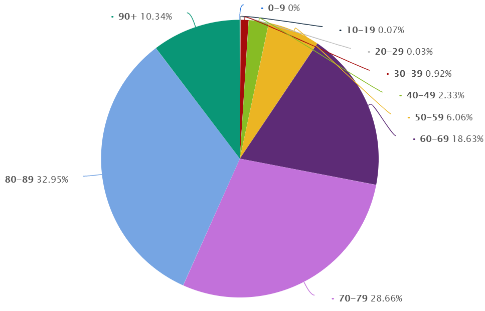

```{r setup, include=FALSE}
knitr::opts_chunk$set(echo = FALSE)
```

```{r loading_packages, include = FALSE}
library(dplyr)
library(ggplot2)
library(scales)
```

```{r source, include=FALSE}
source("Jaszczuk_Paulina_hw2.R")
```

# Wykres poprawiany



[Link do źródła](https://www.statista.com/statistics/1110890/poland-coronavirus-covid-19-fatalities-by-age/)

# Wykres poprawiony

```{r correct_plot}
my_corrected_plot(data)
```

# Uzasadnienie:
- Udowodniono, że wykres kołowy nieefektywnie przedstawia dane, nadużywa koloru i często wprowadza w błąd, gdyż ludzkie oko nie jest w stanie porównać kątów wycinków poprawnie (kąty ostre są widziane jako mniejsze niż w rzeczywistości, podczas gdy rozwarte jako większe).
- Nie da się stworzyć efektywnego wizualnie porównania między wykresami kołowymi.
- Na powyższym wykresie kołowym legenda/etykiety danych są źle widoczne i zmuszamy odbiorce by śledził cienką linię wiodącą od etykiety do wartości na wykresie.
