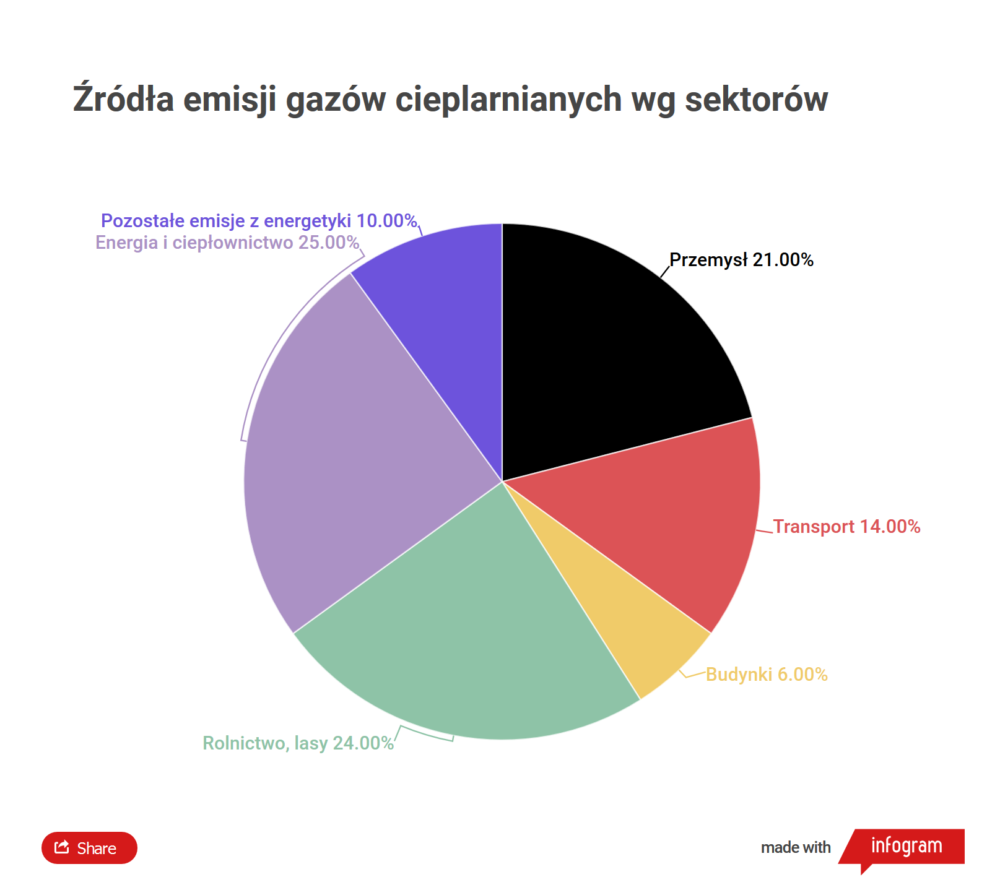

```{r setup, include=FALSE}
knitr::opts_chunk$set(echo = TRUE)
```

# Wykres do poprawy

*Źródło: https://wiadomosci.gazeta.pl/wiadomosci/7,174372,26390049,neutralnosc-klimatyczna-decyzje-w-najblizszej-dekadzie-odegraja.html*
*16.10.2020*


# Wykres poprawiony

```{r}

library(ggplot2)

data <- data.frame(
  "Sektor" = c("Energia i\nciepłownictwo", "Rolnictwo i lasy","Przemysł","Transport",
  "Pozostałe emisje\nzenergetyki","Budynki"),
  "Val"= c(0.25,0.24,0.21,0.14,0.10,0.06))

ggplot(data, aes(x=reorder(Sektor,-Val),y=Val)) +
  geom_col(fill="#00000066",color = "#330000") +
  labs(title = "Źródła emisji gazów cieplarnianych wg sektorów", x = "Sektor", y = "Udział") + 
  scale_y_continuous(labels = scales::percent_format(accuracy = 1)) 
```

# Co poprawiono?

- Zmiana typu wykresu oraz posortowanie wg wartości ułatwia porównanie wyników
- Zredukowanie kolorów niepotrzebnych w po zmianie typu wykresu
- Usunięcie niepotrzebnych zer po przecinku