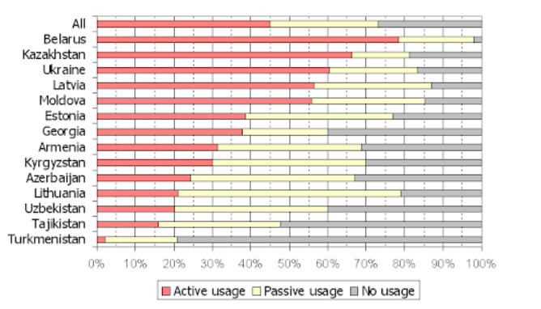

```{r setup, include=FALSE}
knitr::opts_chunk$set(echo = TRUE)
library(ggplot2)
dataframe <- data.frame(country = rep(c("All", 
                                        "Belarus",
                                        "Kazakhstan",
                                        "Ukraine" ,
                                        "Latvia" ,
                                        "Moldova" ,
                                        "Estonia" ,
                                        "Georgia",
                                        "Armenia" ,
                                        "Kyrgyzstan" ,
                                        "Azerbaijan" ,
                                        "Lithuania" ,
                                        "Uzbekistan" ,
                                        "Tajikistan",
                                        "Turkmenistan"), each=3),
                        type = rep(c("Active usage", "Passive usage", "No usage"), 15 ),
                        percent = c(0.45, 0.28, 0.27,0.78, 0.19, 0.03, 0.66, 0.15, 0.19,
                                    0.60, 0.24, 0.16, 0.56, 0.31, 0.13,0.56, 0.29, 0.15,
                                    0.39, 0.39, 0.22, 0.38, 0.22, 0.4, 0.31, 0.38, 0.31, 
                                    0.30, 0.40, 0.30, 0.24, 0.43, 0.33, 0.21, 0.58, 0.21,
                                    0.20, 0.40, 0.40,0.16, 0.32, 0.52, 0.03, 0.18, 0.79))
dataframe$type <-  factor(dataframe$type, levels= c("No usage", "Passive usage", "Active usage"))
dataframe$country <-  factor(dataframe$country, levels= rev(c("All", 
                                                          "Belarus",
                                                          "Kazakhstan",
                                                          "Ukraine" ,
                                                          "Latvia" ,
                                                          "Moldova" ,
                                                          "Estonia" ,
                                                          "Georgia",
                                                          "Armenia" ,
                                                          "Kyrgyzstan" ,
                                                          "Azerbaijan" ,
                                                          "Lithuania" ,
                                                          "Uzbekistan" ,
                                                          "Tajikistan",
                                                          "Turkmenistan")))
plot4 <- ggplot(dataframe, aes(x = country, y = percent * 100, fill = as.factor(type))) + 
  geom_col(width = 0.5) + geom_text(aes(label = percent*100), position=position_stack(0.5)) + ggtitle("Russian speakers in each country") + theme(plot.title = element_text(hjust = 0.5)) + coord_flip() + guides(fill = guide_legend(reverse = TRUE))
plot4$labels[2] = "Country" 
plot4$labels[3] = "% Percent of speakers" 
plot4$labels[4] = "Legend:" 

```
## Wersja oryginalna

[Link do oryginalu]("https://www.textunited.com/blog/top-10-languages-localization/")



\newpage
## Wersja poprawiona

```{r echo=FALSE}
plot4
```

## Komentarz

W wykresie oryginalnym problem stwarzalo obliczenie, jaki procent populacji danego kraju pasywnie posluguje sie jezykiem rosyjskim. Postanowilem dodac etykiety okreslajace procent populacji danej grupy. Dodatkowo zamiescilem tytul wykresu oraz podpisalem os x oraz y.

