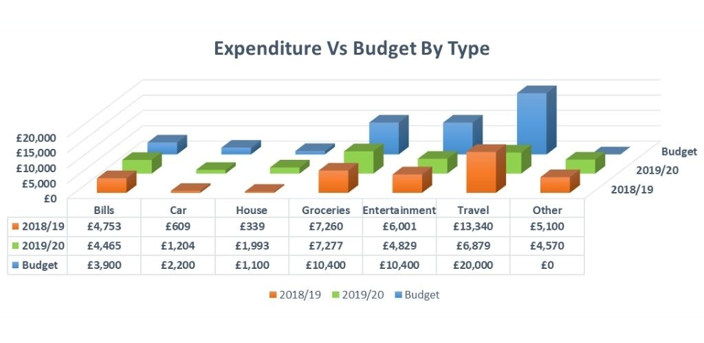

***
```{r setup, include=FALSE}
knitr::opts_chunk$set(echo = TRUE)
library(ggplot2)
```


```{r plot, echo=FALSE}
variable <- rep(c("bills", "car", "house", "groceries", "entertainment", "travel", "other"), each = 3)
year <- rep(c("2018/19", "2019/20", "Budget"), times = 7)
value <- c(4753, 4465, 3900, 609, 1204, 2200, 339, 1993, 1100, 7260, 7277, 10400, 6001, 4829, 10400, 13340, 6879, 20000, 5100, 4570, 0)

DF <- data.frame(year, variable, value)
DF$variable <- factor(DF$variable, levels = c("car", "house", "bills", "entertainment", "travel", "groceries", "other"))

plot <- ggplot(DF, aes(y = value, x = variable, fill = factor(year)), ) +
  geom_bar(stat = "identity", position = "dodge") +
  scale_y_continuous(labels=scales::dollar_format(prefix=intToUtf8(163)), breaks = seq(from = 0, to = 20000, by = 2500), minor_breaks = seq(from = 0, to = 21500, by = 500)) +
  scale_fill_discrete(name = "") + 
  xlab("type of expense") + ylab("") +
  ggtitle("Expenditure vs budget (by type)") 

```

#Oryginalny wykres

źródło: https://fireandwide.com/enough_financial_budget_retirement/

#Mój wykres
```{r project, echo = FALSE}
plot
```

#Komentarz
Na wykresie oryginalnym wysokości słupków zielonych i pomarańczowych były nie do odczytania, ponieważ znajdowały się one "daleko" od skali. Dodatkowo, efekt 3D sprawia, że bardzo trudno dokładnie porównać wysokości słupków pomiędzy sobą. W swoim wykresie naprawiłem oba te problemy.
