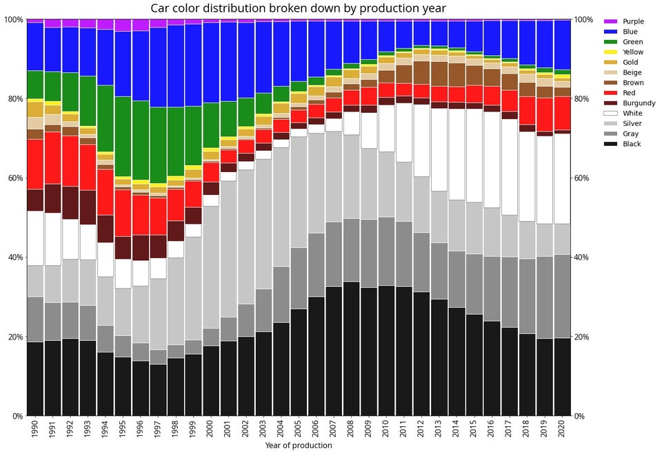

```{r code, include=FALSE, echo=FALSE}
source("code.R")
```


# Oryginalna wizualizacja

[**Oryginalny wykres**](https://www.reddit.com/r/dataisbeautiful/comments/j7yfqb/oc_car_color_distribution_broken_down_by/) został zamieszczony przez użytkownika u/Feemiror w społeczności r/DataIsBeautiful na stronie reddit.com. Wykres zestawia kolor z rokiem produkcji samochodu. Dane pozyskano z 3,5 miliona ofert sprzedaży samochodów nowych i używanych w Polsce. Wizualizacja jest dobra, ale niektóre informacje są słabo czytelne w tej formie wykresu, na przykład odpowiedzi na pytania: 

* W którym roku wyprodukowano najwięcej aut srebrnych? 
* Jaki procent samochodów wyprodukowanych w 2010 było białych?

\pagebreak

# Odtworzenie
```{r recreated, echo=FALSE}
recreated()
```

## Kod 
```{r eval=FALSE}
cars_color_processed %>%
  ggplot(aes(x = factor(Year), y = value, fill = Color)) +
  geom_bar(stat = "identity",  color = "black", size = 0.1) +
  scale_fill_manual(values = color_ggplot) +
  scale_y_continuous("", labels = scales::percent) +
  scale_x_discrete(name = "Year of production",
                   breaks = 1990:2020, labels = as.character(1990:2020)) + 
  theme(panel.grid.major = element_blank(), 
        panel.grid.minor = element_blank(),
        panel.background = element_blank(),
        axis.text.x = element_text(angle = 90, vjust = 0.5, hjust = 1)) +
  ggtitle("Car color distribution broken down by production year")
```

\pagebreak

# Ulepszenie
```{r improved, echo=FALSE}
improved()
```
W mojej wersji zmieniłem typ wykresu na liniowy, dzięki czemu lepiej widać trendy pojedynczych kolorów. Niestety, niektóre barwy były bardzo bliskie 0%, przez co wykres stawał się mniej czytelny. Dlatego połączyłem je w jedną kategorię "Other". Dodatkowo, obróciłem etykietę osi x (lata) o 45 stopni, żeby była bardziej czytelna. Według mnie, ten wykres lepiej wizualizuje odpowiedzi na szczegółowe pytania, ale oryginalny daje lepszy podgląd ogólnych trendów. W zależności co jest potrzebne, moja wersja może być bardziej odpowiednia.

## Kod
```{r eval=FALSE}
cars_color_improved %>%
  ggplot(aes(x = factor(Year), y = value, group= Color)) +
  geom_line(color = "black", size = 1.5) + # outline, żeby było widać białą
  geom_line(aes(color =  Color), size = 1.2) +
  scale_color_manual(values = color_ggplot_improved) +
  scale_y_continuous("", labels = scales::percent) +
  scale_x_discrete("Year of production", 
                   breaks = 1990:2020, labels = as.character(1990:2020)) + 
  theme_light() +
  theme(axis.text.x = element_text(angle = 45, hjust = 1),
        axis.title.x.bottom = element_text(vjust = -1)) +
  ggtitle("Car color distribution broken down by production year")
```