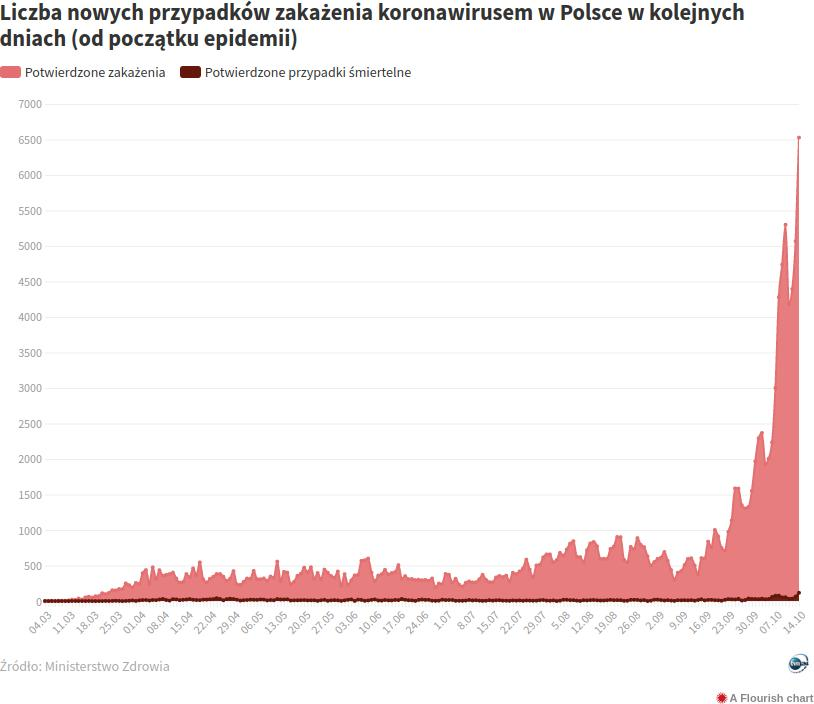

```{r setup, include=FALSE}
knitr::opts_chunk$set(echo = TRUE, dev='cairo_pdf') # polish letters on plots
library(ggplot2)
library(ggthemes)
library(dplyr)

# downloading data
data <- read.csv(url("https://opendata.ecdc.europa.eu/covid19/casedistribution/csv"))

# filtering data
df_Poland <- data %>% 
  filter(countriesAndTerritories == "Poland") %>%
  mutate(Data = as.Date(dateRep, "%d/%m/%y"))%>%
  mutate(`Potwierdzone przypadki`= as.numeric(as.character(cases))) %>%
  filter(Data<as.Date("15/10/2020", "%d/%m/%y")) %>%
  arrange(Data)
```

## Oryginalny wykres

Poprawiany wykres znalazłem na stronie [tvn24.pl](https://tvn24.pl/polska/koronawirus-w-polsce-mapa-zakazen-dzisiaj-statystyki-najnowsze-dane-14-pazdziernika-2020-4344739)




## Mój wykres


```{r, plot, tidy = TRUE}
# coefficent to scale Y axis
coeff <-max(df_Poland$deaths) / max(df_Poland$cases)

# declaring graph colors
deaths_color <- "orange4"
cases_color <- "red"

ggplot(data = df_Poland, aes(x = Data)) +
  # deaths as barplot
  geom_bar(aes(y = deaths/coeff), stat = 'identity', 
           alpha=0.7, fill = deaths_color,color = "gray", size = 0.1) + 
  # cases as line
  geom_line(aes(y = `Potwierdzone przypadki`), color = cases_color) +
  # adding second Y axis
  scale_y_continuous(
    name = "Potwierdzone zakażenia" ,
    sec.axis = sec_axis(~.*coeff, name = "Potwierdzone przypadki śmiertelne")
    ) + 
  # scaling and labeling X axis 
  scale_x_date(date_breaks = "1 week", date_labels = "%d.%m")+
  # adding themes
  theme_hc() + 
  theme(
    axis.title.y = element_text(color = cases_color, size=10),
    axis.title.y.right = element_text(color = deaths_color, size=10),
    axis.text.x=element_text(angle=60, hjust=1)
  ) +
  ggtitle("Liczba nowych przypadków zakażenia koronawirusem
i przypadków śmiertelnych w Polsce w kolejnych dniach")
```

## Co i dlaczego zmieniono?

Zastosowano dwie skale na osi Y, przez co można łatwiej odczytać słupki z liczbami zgonów. Zmieniono tytuł wykresu na odpowiadający przedstawianym danym. 

