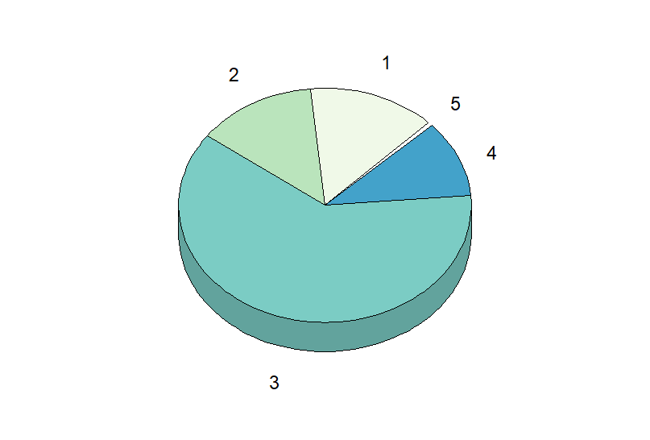

```{r setup, include=FALSE}
knitr::opts_chunk$set(echo = TRUE)
pdf.options(encoding='ISOLatin2.enc')
```

# Wykres poddany ankiecie
Korzystając z ramki danych 'countries', utworzyłem trójwymiarowy pie chart przedstawiający
procentową dystrybucję populacji na każdy kontynent. W użytym grafie utajniłem jakich danych
dotyczy wykres aby ankietowani nie sugerowali się swoją potencjalną wiedzą dotyczącą danych
przedstawionych na wykresie. Wszystkie opisy kontynentów zastąpiłem abstrakcyjnymi liczbami
od 1 do 5. Użyte kolory również nie były przypadkowe, postarałem się użyć bardzo zbliżonej
kolorystyki aby wykorzystać zjawisko pasm Macha co powinno zniekształcić odbiór danych jeszcze
bardziej. Kolory na wykresie zostały specjalnie przesunięte o pewien kąt, by największa zawartość
danych opisana cyfrą 3 była na dole wykresu.


# Sposób prowadzenia ankiety
Moim głównym źródłem danych była utworzona przeze mnie ankieta internetowa, stworzona za pomocą
narzędzi googl'a. Oto link do ankiety : https://forms.gle/NMUPuMRwB4j316F68.
Ankietę umieściłem na kilku grupkach facebookowych oraz rozesłałem do znajomych, ale również 
do rodziny. W sumie uzyskałem 23 wyniki dla każdego koloru. Do stworzenia "manupulanckiego"
wykresy urzyłem biblioteki "plotrix", która pozwala na tworzenie wykresów kołowych 3D.

# Originalny wykres oraz dane referencyjne
Poniżej wymieniony wykres zawiera opisy poszczególnych danych, oraz tytuł.
Procentowymi danymi dla każdego z kontynentów były:
Afryka - 14%
Ameryki - 13.4%
Azja - 61.4%
Europa - 10.6%
Oceania- 0.54%
# Wgrywanie pakietów
```{r, echo=FALSE}
library(dplyr)
library(plotrix)
library("RColorBrewer")
library(SmarterPoland)
```
# Kod do wykresu
```{r,warning = FALSE,error=FALSE,message = FALSE}

Population_of_the_wrold = sum(countries$population)
continents_population <- 
group_by(countries,continent) %>% 
  summarize(Percentage = (100*sum(population)/Population_of_the_wrold))

pie3D(continents_population$Percentage,
      labels = continents_population$continent,
      main = "Distribution of population by continents",
      col = brewer.pal(n = 5, name = "GnBu"),
      radius = 1, theta = 2*pi/5,start = pi/4)

wartosci_realne = continents_population$Percentage
names(wartosci_realne) <- c("Africa","Americas","Asia","Europe","Oceania")

```
# Dane zwrotne i wykres rozbieżności
Jak wcześniej powiedziałem, otrzymałem 23 wyniki zwrotne od ankietowanych.
Oto wykres 
```{r}
wyniki_Afryka <- c(18,15,12,15,10,16,15,13,15,16,13,11,10,9,16,16,13,12,9,20,15,25)
wyniki_Americas <-c(10,15,10,8,10,15,14,12,15,14,11,10,9,9,14,14,11,14,9,17,14,25)
wyniki_Asia <-c(60,60,70,68,68,54,57,61.5,58,57,55,60,63,62.5,61,59,56,55,56,67,58,75)
wyniki_Europe <-c(10,10,8,8,10,14,14,12,10,13,11,10,9,7,9,13,11,14,8,17,12,24)
wyniki_Oceania <-c(2,1,1,1,2,1,2.5,1.5,1,1.5,0.4,0.5,1,1,0,1,0.3,0.4,0.7,0.7,1,2)


boxplot(wyniki_Afryka, wyniki_Americas, wyniki_Asia,wyniki_Europe,wyniki_Oceania,
        names=c("Afryka","Ameryki","Azja","Europa","Oceania"),
        main="Odchylenie dla każdego z kontynentów",
        xlab="Kontynenty",
        ylab="Wartość w procentach",
        col="steelblue",
        border="black") 

points(c(1,2,3,4,5), c(14,13.4,61.4,10.6,0.54), col = "orange",pch=19)
```

Pomarańczowe kropki, są wynikiem obliczonym za pomocą fomruły na ramce danych, więc jest to wynik prawidłowy.

# Konkluzje
Oczywiście podane przez odbiorców dane nie były dopasowane do wartości precyzyjnych i odbiegały od niej, lecz 
zaskakującym jest, iż przy wykorzystaniu jednego z najgorsych typów wizualizaji danych, ich odbiór nie odbiegał
aż tak znacząco jak możnabyłoby się spodziewać.
Odpowiednio średnia wyników oraz odchylenie standardowe dla kontynentów wynosiły:\newline
Aftyka: 14.27 i 3.74\newline
Ameryki: 12.73 i 3.74\newline
Azja: 60.95 i 5.54\newline
Europa: 11.55 i 3.72\newline
Oceania: 1.06 i 0.63\newline
```{r}
mean(wyniki_Afryka)
sd(wyniki_Afryka)
mean(wyniki_Americas)
sd(wyniki_Americas)
mean(wyniki_Asia)
sd(wyniki_Asia)
mean(wyniki_Europe)
sd(wyniki_Europe)
mean(wyniki_Oceania)
sd(wyniki_Oceania)

```
Odpowiednio błędy względne i bezwzględne dla każdego z kontynentów wynosiły: \newline
Afryka - 2% i 0.27\newline
Ameryki -5% i 0.67\newline
Azja - 0.7% i 0.45\newline
Europa - 9% i 0.95\newline
Oceania - 96% i 0.52\newline

Może trójwymiarowy piechart jest przez nas traktowany zbyt ozięble? Różnice w odbiorze istnieją, względnie nie są znaczące
dla danych mających duży udział procentowy, im większe pole zajmuje dana kategoria, tym lepiej odczytujemy jego wartość.
Niestety dla małych pól, wartości odczytujemy fatalnie, np. błąd względny dla Oceanii i stosunkowo duży dla Europy.
Oczywiście dla każdego kontynentu bład wyraża się w milionach ludzi, co dla precyzyjnych wymogów jest niedopuszczalne.
A zatem, piechart 3D może być pewnym przybliżeniem wartości danych, gdy nie jest ich dużo i ich udziały są dość znaczące (więcej niż 13% koła.), zatem jest to dość spore ograniczenie jego użytecznośći i najlepiej posługiwać się najbezpieczneijszym słupkowym wykresem.


