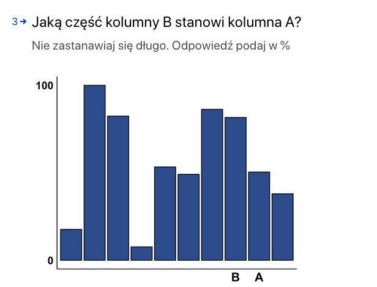
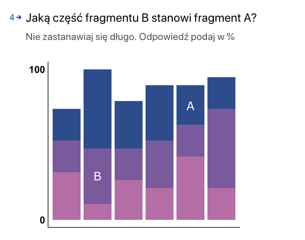
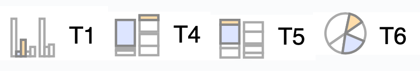
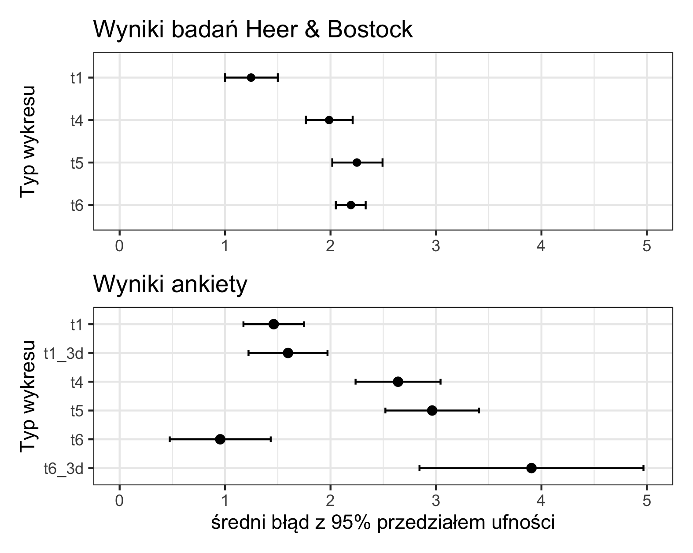
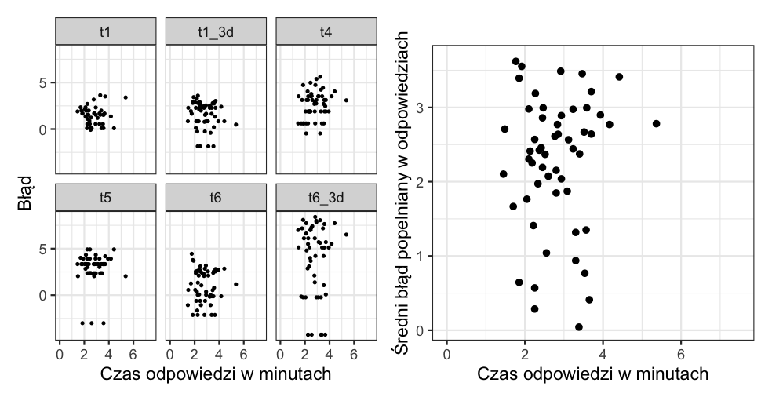

```{r setup, include=FALSE}
knitr::opts_chunk$set(echo = FALSE)
```

## Wstęp
W poniższej pracy przeprowadziłem ankietę badającą typy wykresów pod względem łatwości porównawania wartości przez odbiorcę. Metodę wzorowałem na dwóch wcześniejszych badaniach tego tematu [1,2], by móc porównać wyniki pomiędzy badaniami. Ankieta objęła wybrane typy wykresów z poprzednich badań (wykresy kolumnowe różnego rodzaju, wykresy kołowe). Dodałem również do badania wersje 3D wykresów koumnowych i kołowych. Link do ankiety: https://form.typeform.com/to/IEDukyiY

## Metoda
Ankietę przeprowadziłem wśród N=59 osób. Ankietowany jest proszony o szybkie porównanie dwóch zazacznonych wartości i ocenę jaki procent pierwszej wartości stanowi druga wartość. Aby odsiać osoby, które nie zrozumiały pytań, pierwsze dwa pytania mają odpowiedzi zamknięte, gdzie jedna jest właściwa a pozostałe skrajnie niepoprawne. Łącznie jest 12 pytań. Poniżej dwa przykładowe pytania otwarte:

```{r images, out.width="50%"}


```
W ankiecie zbadano poniższe rodzaje wykresów. Oznaczono je według konwencji z poprzednich badań. Dodatkowo zbadano wersje 3D wykresów T1 i T6. 
```{r, out.width="60%", fig.align='center'}

```
By móc porównać wyniki do poprzednich badań, błąd obliczano użytym w nich wyrażeniem $log_{2}(|\text{odpwiedź} - \text{prawidłowa odpowiedź}| + \frac{1}{8})$.

## Wyniki i wnioski
Poniżej porównanie wyników ankiety z wynikami badania [2]:
```{r, out.width="70%", fig.align='center'}

```
Przy porównywaniu wyników można zauważyć, że relacje błędów pomiędzy wykresami odpowiadają sobie mniej więcej w obu badaniach (oprócz wykresu kołowego 2D) oraz że uczestnicy tej ankiety popełnili nieco większe błędy w porównywaniu wartości. Przedziały ufności są nieco szersze niż w badaniu z 2010 r. Wykresy trójwymiarowe, czego można było się spodziewać, okazały się trudniejsze do porównywania wartości od swoich odpowiedników 2D.

W przypadu wykresów kołowych (T6) widać, że odpowiedzi były wyjątkowo dokładne względem pozostałych. Mogło być to spowodowane tym, że dane przedstawione na  wykresach kołowych były małymi liczbami całkowitymi (*1,2,3,4,5*), natomiast w przypadku pozostałych typów wykresów dane zostały wygenerowane losowo za pomocą funkcji `runif()`. Przez to ilrazy porównywanych wartości były "popularnymi" ułamkami ($\frac{1}{2}$ i $\frac{1}{3}$), stąd wiele odpowiedzi było bezbłędnych, zaniżając mocno średnią.
\newpage
Podczas wypełniania ankiety, rejestrowany był również czas otwarcia i zamknięcia ankiety, dzieki czemu można zbadać zależności pomiedzy błędami a czasem wypenienia ankiety. Jednak po analizie poniższych wykresów, można zauważyć, że taka zaleźność nie występuje. Dotyczy to błędów przy poszczególnych typach wykresów (wykres po lewej), jak i uśrednionym błędzie wszystkich pytań (wykres po prawej, jedna kropka odpowiada jednemu respondentowi).
```{r, out.width="90%", fig.align='center'}

```
## Materiał źródłowy
1. W. S. Cleveland and R. McGill. *Graphical perception: Theory, experimentation, and application to the development of graphical methods.* 1984
2. Jeffrey Heer and Michael Bostock. *Crowdsourcing Graphical Perception: Using Mechanical Turk to Assess Visualization Design* 2010