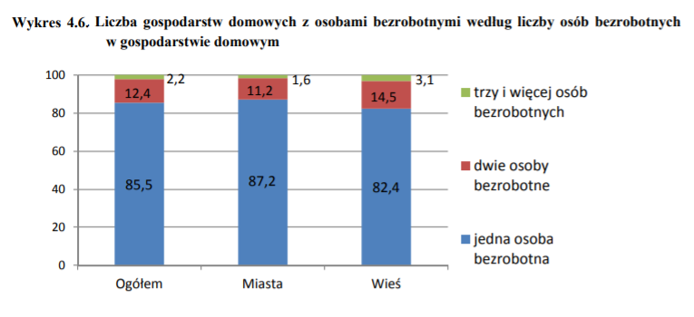

```{r setup, include=FALSE}
knitr::opts_chunk$set(echo = TRUE)
library(ggplot2)

data <- data.frame(plec = rep(c("Ogolem", "Miasto", "Wies"), each = 3),
                   liczba_osob_bezrobotnych = rep(rev(c("3 lub wiecej", "2", "1")), 3), proc = c(85.5, 12.4, 2.2, 87.2, 11.2, 1.6, 82.4, 14.5, 3.1)) 
data$plec <- factor(data$plec, levels = c("Ogolem", "Miasto", "Wies"))
data$liczba_osob_bezrobotnych <-  factor(data$liczba_osob_bezrobotnych, levels = rev(c("3 lub wiecej", "2", "1")))
plot <- ggplot(data, aes(x = plec, y = proc, fill = liczba_osob_bezrobotnych)) + geom_bar(stat = "identity", position = "dodge") + geom_text(aes(label = proc), position=position_dodge(width = 1), vjust = -0.3) + ggtitle(" Liczba gospodarstw domowych z osobami bezrobotnymi \n według liczby osób bezrobotnych w gospodarstwie domowym") + theme(plot.title = element_text(hjust = 0.5, lineheight = NULL))

plot$labels[2] <-  "Rodzaj miejsca zamieszkania" 
plot$labels[3] <-  "% Procent"       
plot$labels[4] <-  "Liczba osob bezrobotnych"       
plot

```

## Wersja oryginalna




\newpage
## Wersja poprawiona

```{r echo=FALSE}
plot
```

## Komentarz

W wykresie oryginalnym problemem delikatnie zaburzajacym mozliwosci porownania poszczegolnych kolumn byl fakt, ze kolumny dotyczace jednego typu miejsca zamieszkania byly umieszczone jedne na drugim. Tak poprawiony wykres co prawda nie optymalizuje odbioru w sposob szczegolnie wielki, jednak w pewnym stopniu ulatwia porownywanie wartosci miedzy soba.

