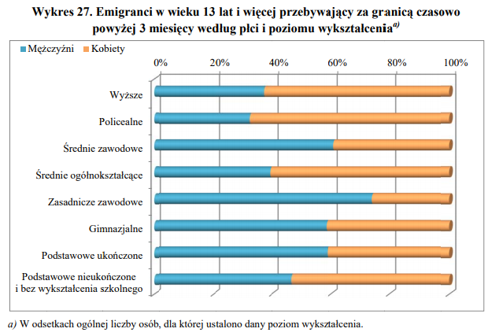

```{r setup, include=FALSE}
knitr::opts_chunk$set(echo = TRUE)
```

## Oryginalny wykres

Wykres pochodzi z danych GUS'u, z bazy danej Migracje Ludności, str. 66.




## Wykres poprawiony

```{r, warning=FALSE,message=FALSE}
library(data.table)
library(ggplot2)
library(dplyr)
library(tidyr)

wyksztalcenie <- c("Wyzsze","Policealne","Srednie zawodowe",
                   "Srednie ogolnoksztakcace","Zasadnicze zawodowe",
                   "Gimnazjalne","Posdstawowe ukonczone",
                   "Podstawowe nieukonczone i\nbez wyksztalceniea szkolego",
                   "Wyzsze","Policealne","Srednie zawodowe",
                   "Srednie ogolnoksztakcace","Zasadnicze zawodowe",
                   "Gimnazjalne","Posdstawowe ukonczone",
                   "Podstawowe nieukonczone i\nbez wyksztalceniea szkolego")
wartosci <- c(63,68,41,61,29,43,43,56,37,32,59,39,71,57,57,44)
plec <-c("Kobiety","Kobiety","Kobiety","Kobiety",
         "Kobiety","Kobiety","Kobiety","Kobiety",
         "Mezczyzni","Mezczyzni","Mezczyzni","Mezczyzni",
         "Mezczyzni","Mezczyzni","Mezczyzni","Mezczyzni")
data <- data.frame(wyksztalcenie,wartosci,plec)
data$wyksztalcenie <- factor(data$wyksztalcenie,
                      levels = c("Wyzsze","Policealne","Srednie zawodowe",
                                "Srednie ogolnoksztakcace","Zasadnicze zawodowe",
                                "Gimnazjalne","Posdstawowe ukonczone",
                                "Podstawowe nieukonczone i\nbez wyksztalceniea szkolego"))

ggplot(data, aes(y=wyksztalcenie, x=wartosci, condition=plec,fill=plec)) + 
  geom_bar(position="dodge", stat="identity")+ 
    geom_text(aes(x = wartosci, y = wyksztalcenie, label = wartosci, group = plec),
    hjust = -0.5, size = 2,
    position = position_dodge(width = 1),
    inherit.aes = TRUE) +
  labs(title = "Emigranci w wieku 13 lat i wiecej przebywajacy
                \nza granica czasowo powyzej \n3 miesiecy wedlug
                plci i poziomu wyksztalcenia"
                ,y = "Ukonczone Wyksztalcenie",
                x = "Procentowa ilosc grupy")+
  scale_x_continuous(labels = paste(seq(from = 0, to = 80, by = 10),"%"),
                     breaks = seq(from = 0, to = 80, by = 10))+
  scale_y_discrete(limits = unique(rev(data$wyksztalcenie)))+
    theme_bw() 

```

## Co poprawiono
Przede wszystkim wykres 3D został zmieniony na 2D. Jeden zagregowany słupek 
zamieniłem na dwa osobne dla każdej grupy w każdej kategorii oraz dokleiłem wartość dla 
każdej z danych. 

