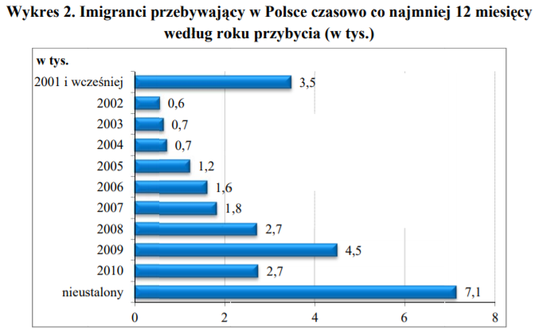

```{r echo=FALSE, warning=FALSE, message=FALSE}
library("dplyr")
library("ggplot2")
df <- data.frame(rok = c("2001 i wcześniej", "2002", "2003", "2004", "2005", "2006", "2007", "2008", "2009", "2010", "nieustalony"),
                 ilosc = c(3.5, 0.6, 0.7, 0.7, 1.2, 1.6, 1.8, 2.7, 4.5, 2.7, 7.1))


ggplot(data = df, aes(x = rok, y = ilosc)) +
  geom_col(fill = "blue", width = 0.5) +
  geom_text(aes(label = ilosc), vjust=-0.3, size=3.5) +
  labs(x = "", y = "liczba w tys.", title = "Imigranci przebywający w Polsce czasowo co najmniej 12 miesięcy\nwedług roku przybycia (w tys.)") +
  scale_y_continuous(
    breaks = seq(0, 8, 2),
    limits = c(0, 8),
    expand = expansion(mult = c(0, 0))) +
  theme(
    axis.line.y = element_line(size = 0.5, linetype = "solid", colour = "black"),
    axis.line.x = element_line(size = 0.5, linetype = "solid", colour = "black"),
    panel.grid.major.x = element_blank(),
    panel.grid.minor.y = element_blank(),
    panel.grid.major.y = element_line(size = 0.25, linetype = "solid", colour = "gray"),
    panel.background = element_rect(fill = "white", colour = "white"),
    axis.text.x = element_text(angle=45,hjust=0.95,vjust=0.9)
  )
```


