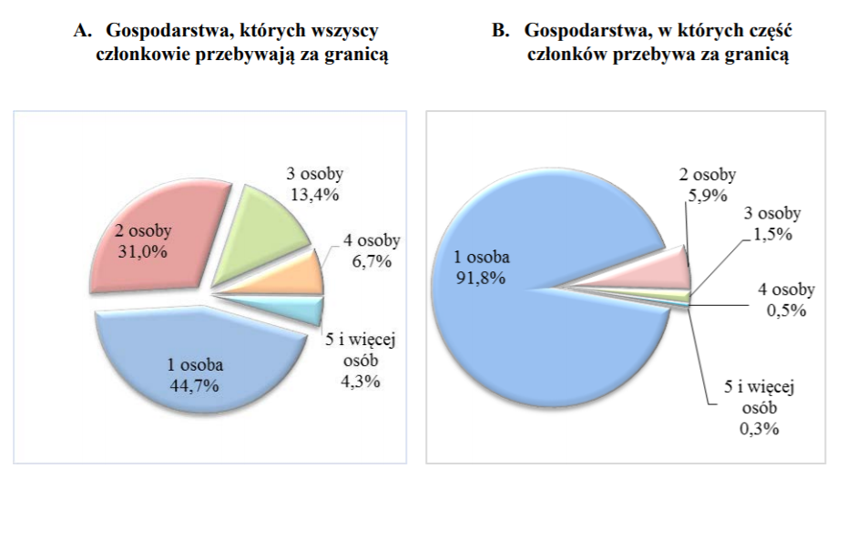

```{r setup, include=FALSE}
knitr::opts_chunk$set(echo = FALSE)
```

```{r loading_packages, include = FALSE}
library(dplyr)
library(ggplot2)
library(scales)
```

```{r source, include=FALSE}
source("Paulina_Jaszczuk_hw5.R")
```

# Wykres poprawiany




# Wykres poprawiony

```{r correct_plot}
my_corrected_plot(data)
```
```{r correct_plot2}
my_corrected_plot2(data2)
```

