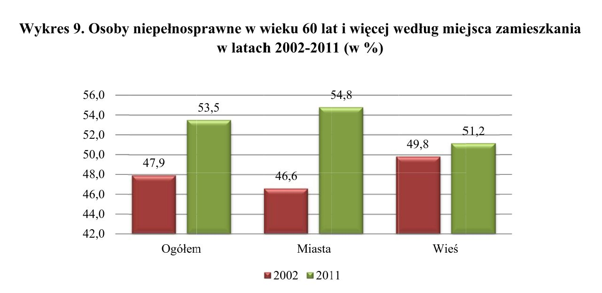

## Wykres Oryginalny 



## Zródło 

https://stat.gov.pl/spisy-powszechne/nsp-2011/nsp-2011-wyniki/migracje-zagraniczne-ludnosci-nsp-2011,13,1.html

# Wykres Poprawiony


```{r echo=FALSE}

library(ggplot2)
library(ggthemes)
kategorie <- c("Ogółem","Ogółem","Miasta","Miasta","Wieś","Wieś")
wartosci <- c(0.479,0.535,0.466,0.548,0.498,0.512)
rok <- c(2002,2011,2002,2011,2002,2011)
df <- data.frame(kategorie,wartosci,rok)
ggplot(df,aes(x = kategorie, y = wartosci,label = scales::percent(wartosci))) + geom_bar(aes(fill = factor(rok)),stat='identity')  + labs(fill = element_blank(),x = element_blank(),y = element_blank(),title = "Osoby niepełnosprawne w wieku 60 lat i więcej według \n miejsca zamiekszania w latach 2002-2011 (w %)") + scale_y_continuous(labels = scales::percent) + 
   geom_text(size = 5,position = position_fill(vjust = 0.5)) + coord_flip() + theme_bw()

```

