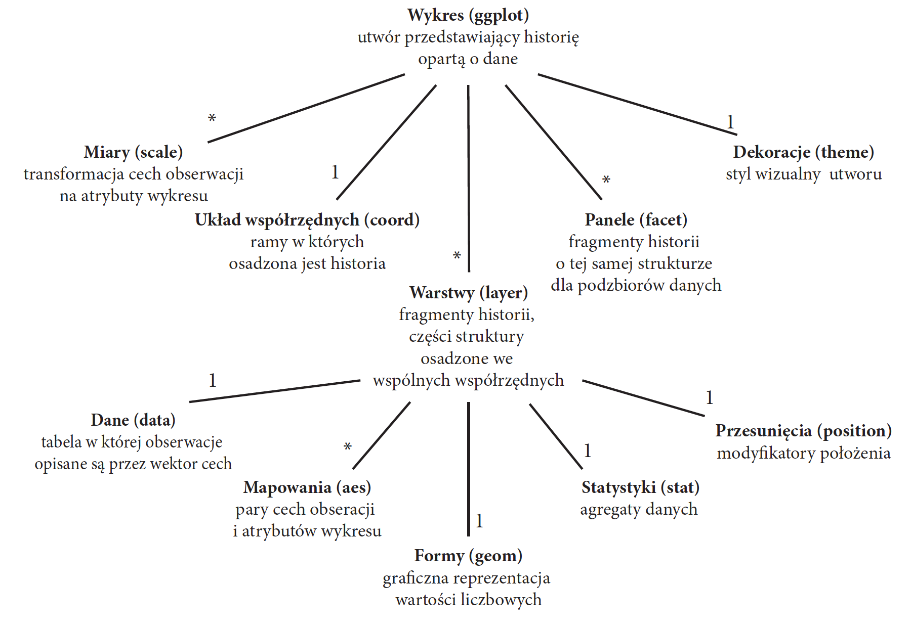

<link href="https://fonts.googleapis.com/css?family=Montserrat&display=swap" rel="stylesheet">

<style>
slides > slide {
  font-family: 'Montserrat', sans-serif;
}

.center {
  display: block;
  margin-left: auto;
  margin-right: auto;

}


</style>


```{r setup, include=FALSE}
library(knitr)
library(rgl)
library(ggplot2)
library(plotly)
library(dplyr)
library(patchwork)
library(ggthemes)
opts_chunk$set(echo = FALSE, message = FALSE, warning = FALSE)
knit_hooks$set(webgl = hook_webgl)
data("midwest", package = "ggplot2")
options(scipen=999)  # turn-off scientific notation like 1e+48
theme_set(theme_bw())  # pre-set the bw theme.
```


# Gramatyka grafiki: ustrukturyzowany opis wizualizacji danych.


## Gramatyka grafiki



Źródło: http://www.biecek.pl/Eseje/indexGramatyka.html


## Układ współrzędnych


Źródło: http://www.biecek.pl/Eseje/indexGramatyka.html

## Układ współrzędnych

Układ współrzędnych (coord): ramy, w których osadzona jest historia.


```{r, echo=FALSE,warning=FALSE}
df = data.frame(x = c(0,1,2), y = c(5,6,7))
p1 <- ggplot(df, aes(x=x, y=y)) +
  xlab("") +
  ylab("")
p2 <- ggplot(df, aes(x=x, y=y)) +
  xlab("") +
  ylab("") +
  coord_flip()
p1 + p2
```

## Układ współrzędnych

```{r, eval=FALSE,echo = TRUE, warning=FALSE}
df = data.frame(x = c(0,1,2), y = c(5,6,7))
p1 <- ggplot(df, aes(x=x, y=y)) +
  xlab("") +
  ylab("")
p2 <- ggplot(df, aes(x=x, y=y)) +
  xlab("") +
  ylab("") +
  coord_flip()
p1 + p2
```


## Warstwy


Źródło: http://www.biecek.pl/Eseje/indexGramatyka.html


## Dane


Źródło: http://www.biecek.pl/Eseje/indexGramatyka.html


## Dane

Dane (data): tabela, w której obserwacje opisane są przez wektor chech.

```{r}
head(iris)
```


## Mapowania


Źródło: http://www.biecek.pl/Eseje/indexGramatyka.html

## Mapowania

Mapowania (aes): pary cech obserwacji i atrybutów wykresu.


```{r, echo=FALSE,warning=FALSE}
p1 <- ggplot(iris, aes(x = Sepal.Length, y = Sepal.Width)) + 
  geom_point()

p2 <- ggplot(iris, aes(x = Sepal.Length, y = Sepal.Width, color = Species)) + 
  geom_point()

p3 <- ggplot(iris, aes(x = Sepal.Length, y = Sepal.Width, size = Species)) + 
  geom_point()

(p1 + p2) / p3

```

## Mapowania


```{r, eval=FALSE,echo = TRUE, warning=FALSE}
p1 <- ggplot(iris, aes(x = Sepal.Length, y = Sepal.Width)) +
  geom_point(size = 4)

p2 <- ggplot(iris, aes(x = Sepal.Length, y = Sepal.Width, color = Species)) +
  geom_point(size = 4)

p3 <- ggplot(iris, aes(x = Sepal.Length, y = Sepal.Width, color = Sepal.Length)) +
  geom_point(size = 4)

p4 <- ggplot(iris, aes(x = Sepal.Length, y = Sepal.Width, shape = Species)) +
  geom_point(size = 4)

(p1 + p2) / (p3 + p4)
```


## Formy


Źródło: http://www.biecek.pl/Eseje/indexGramatyka.html

## Formy

Formy (geom): graficzna reprezentacja wartości liczbowych.

```{r, echo=FALSE,warning=FALSE}
p1 <- ggplot(iris, aes(x = Sepal.Length, y = Sepal.Width, color = Species)) +
  geom_point(size = 4)


p2 <- data.frame(label = c("A","A","A","B","B","C","C")) %>%
  ggplot(aes(x = label)) +
 geom_bar()

p3 <- data.frame(a = c(1,2,3,4,5), b =c(2,4,7,8,10)) %>%
  ggplot(aes(x = a, y = b)) +
  geom_line()

p4 <- ggplot(iris, aes(x = Species, y = Sepal.Length, color = Species)) +
  geom_boxplot()


(p1 + p2) / (p3 + p4)

```

## Formy

Formy (geom): graficzna reprezentacja wartości liczbowych.

```{r, echo=TRUE, eval = FALSE, warning=FALSE}
p1 <- ggplot(iris, aes(x = Sepal.Length, y = Sepal.Width, color = Species)) +
  geom_point(size = 4)

p2 <- ggplot(iris, aes(x = Species, y = Sepal.Length)) +
  stat_summary(fun.y = "mean", geom = "bar")

p3 <- ggplot(iris, aes(x = Sepal.Length, y = Sepal.Width, color = Species)) +
  geom_line()

p4 <- ggplot(iris, aes(x = Species, y = Sepal.Length, color = Species)) +
  geom_boxplot()


(p1 + p2) / (p3 + p4)

```


## Statystyki


Źródło: http://www.biecek.pl/Eseje/indexGramatyka.html


## Statystyki

Statystyki (stat): agregaty danych

```{r, echo=FALSE,warning=FALSE}
p1 <- ggplot(iris, aes(x = Sepal.Length, fill = Species)) +
  geom_density(alpha = 0.5)
p2 <- ggplot(iris, aes(x = Species, y = Sepal.Length, color = Species)) +
  geom_boxplot()
p3 <- ggplot(iris, aes(x = Species, y = Sepal.Length, color = Species)) +
  geom_violin()
p4 <- ggplot(iris, aes(x = Sepal.Length, y = Sepal.Width, fill = Species)) +
  stat_density2d(aes(alpha = ..level..), geom = "polygon", color = "black")


(p1 + p2) / (p3 + p4)
```


## Statystyki

Statystyki (stat): agregaty danych

```{r, echo=TRUE,warning=FALSE, eval = FALSE}
p1 <- ggplot(iris, aes(x = Sepal.Length, fill = Species)) +
  geom_density(alpha = 0.5)
p2 <- ggplot(iris, aes(x = Species, y = Sepal.Length, color = Species)) +
  geom_boxplot()
p3 <- ggplot(iris, aes(x = Species, y = Sepal.Length, color = Species)) +
  geom_violin()
p4 <- ggplot(iris, aes(x = Sepal.Length, y = Sepal.Width, fill = Species)) +
  stat_density2d(aes(alpha = ..level..), geom = "polygon", color = "black")


(p1 + p2) / (p3 + p4)
```

## Przesunięcia


Źródło: http://www.biecek.pl/Eseje/indexGramatyka.html

## Przesunięcia

Przesunięcia (position): modyfikatory położenia.

```{r, echo=FALSE,warning=FALSE}
p1 <- ggplot(iris, aes(x = Species, y = Sepal.Length, color = Species)) +
  geom_jitter(position = "identity")
p2 <- ggplot(iris, aes(x = Species, y = Sepal.Length, color = Species)) +
  geom_jitter(position = "jitter")

(p1 + p2)
```

## Przesunięcia

Przesunięcia (position): modyfikatory położenia.

```{r, echo=TRUE,warning=FALSE, eval = FALSE}
p1 <- ggplot(iris, aes(x = Species, y = Sepal.Length, color = Species)) +
  geom_jitter(position = "identity")+
  theme(legend.position = "bottom")
p2 <- ggplot(iris, aes(x = Species, y = Sepal.Length, color = Species)) +
  geom_jitter(position = "jitter") +
  theme(legend.position = "bottom")

(p1 + p2)
```


## Panele


Źródło: http://www.biecek.pl/Eseje/indexGramatyka.html

## Panele

Panele (facets): fragmenty historii o teh samej strukturze dla podzbiorów danych.

```{r, echo=FALSE,warning=FALSE}
ggplot(iris, aes(x = Sepal.Length)) +
  geom_density() +
  facet_wrap(~ Species)
```


## Skale 


Źródło: http://www.biecek.pl/Eseje/indexGramatyka.html

## Skale 

Skale (scale): transformacja cech obserwacji na atrybuty wykresu.


```{r, echo=FALSE,warning=FALSE}
p1 <- ggplot(iris, aes(x = Sepal.Length, y = Sepal.Width)) +
  geom_point() 

p2 <- ggplot(iris, aes(x = Sepal.Length, y = Sepal.Width)) +
  geom_point() +
  scale_x_reverse()

p1 + p2
```

## Skale


```{r, eval=FALSE,echo = TRUE, warning=FALSE}
p1 <- ggplot(iris, aes(x = Sepal.Length, y = Sepal.Width)) +
  geom_point() 

p2 <- ggplot(iris, aes(x = Sepal.Length, y = Sepal.Width)) +
  geom_point() +
  scale_x_reverse()

p1 + p2
```

## Dekoracje


Źródło: http://www.biecek.pl/Eseje/indexGramatyka.html

## Dekoracje

Dekoracje (theme): styl wizualny.

```{r, echo=FALSE,warning=FALSE}
ggplot(iris, aes(x = Sepal.Length, y = Sepal.Width, color = Species, shape = Species)) +
  geom_point(size = 4) +
  theme_economist() +
  ggtitle("Theme: economist")
```

## Dekoracje

Dekoracje (theme): styl wizualny.

```{r, echo=TRUE,warning=FALSE, eval = FALSE}
ggplot(iris, aes(x = Sepal.Length, y = Sepal.Width, color = Species, shape = Species)) +
  geom_point(size = 4) +
  theme_economist() +
  ggtitle("Theme: economist")
```

## Dekoracje

Dekoracje (theme): styl wizualny.

```{r, echo=FALSE,warning=FALSE}
ggplot(iris, aes(x = Sepal.Length, y = Sepal.Width, color = Species, shape = Species)) +
  geom_point(size = 4) +
  theme_tufte() +
  ggtitle("Theme: Tufte")
```


## Dekoracje

Dekoracje (theme): styl wizualny.

```{r, echo=TRUE,warning=FALSE, eval=FALSE}
ggplot(iris, aes(x = Sepal.Length, y = Sepal.Width, color = Species, shape = Species)) +
  geom_point(size = 4) +
  theme_tufte() +
  ggtitle("Theme: Tufte")
```


## Dekoracje

Dekoracje (theme): styl wizualny.

```{r, echo=FALSE,warning=FALSE}
ggplot(iris, aes(x = Sepal.Length, y = Sepal.Width, color = Species, shape = Species)) +
  geom_point(size = 4) +
  theme_excel() +
  ggtitle("Theme: Excel")
```


## Dekoracje

Dekoracje (theme): styl wizualny.

```{r, echo=TRUE,warning=FALSE, eval=FALSE}
ggplot(iris, aes(x = Sepal.Length, y = Sepal.Width, color = Species, shape = Species)) +
  geom_point(size = 4) +
  theme_excel() +
  ggtitle("Theme: Excel")
```


## Do poczytania


[Esej o gramatyce](http://www.biecek.pl/Eseje/indexGramatyka.html)