<link href="https://fonts.googleapis.com/css?family=Montserrat&display=swap" rel="stylesheet">

<style>
slides > slide {
  font-family: 'Montserrat', sans-serif;
}

.center {
  display: block;
  margin-left: auto;
  margin-right: auto;

}


</style>


```{r setup, include=FALSE}
library(knitr)
library(rgl)
library(ggplot2)
library(plotly)
library(dplyr)
library(patchwork)
library(ggthemes)
opts_chunk$set(echo = FALSE, message = FALSE, warning = FALSE)
knit_hooks$set(webgl = hook_webgl)
data("midwest", package = "ggplot2")
options(scipen=999)  # turn-off scientific notation like 1e+48
theme_set(theme_bw())  # pre-set the bw theme.
```


# Percepcja kształtów

##  Pasma Macha

Zniekształcenie postrzegania kolorów.


Źródło: http://www.biecek.pl/Eseje/indexObraz.html

## Iluzja Titchenera - Zniekształcenie postrzegania wielkości.


Źródło: http://www.biecek.pl/Eseje/indexObraz.html

## Warto zapamiętać te przykłady

Na wykresach często przedstawiamy liczby za pomocą pól lub długości. 

Postrzeganie kolorów i wielkości może silnie zależeć od sąsiednich obiektów.

## Obszar widzenia


Źródło: http://www.biecek.pl/Eseje/indexObraz.html

## Obszar widzenia

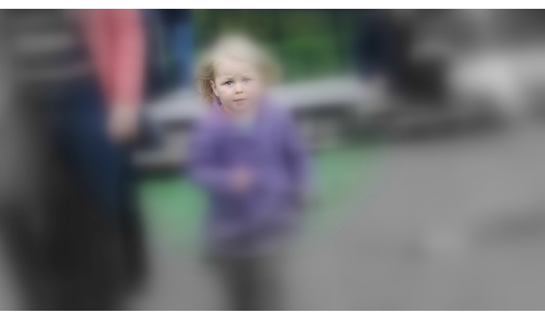

Źródło: http://www.biecek.pl/Eseje/indexObraz.html


## Fiksacje i sakady

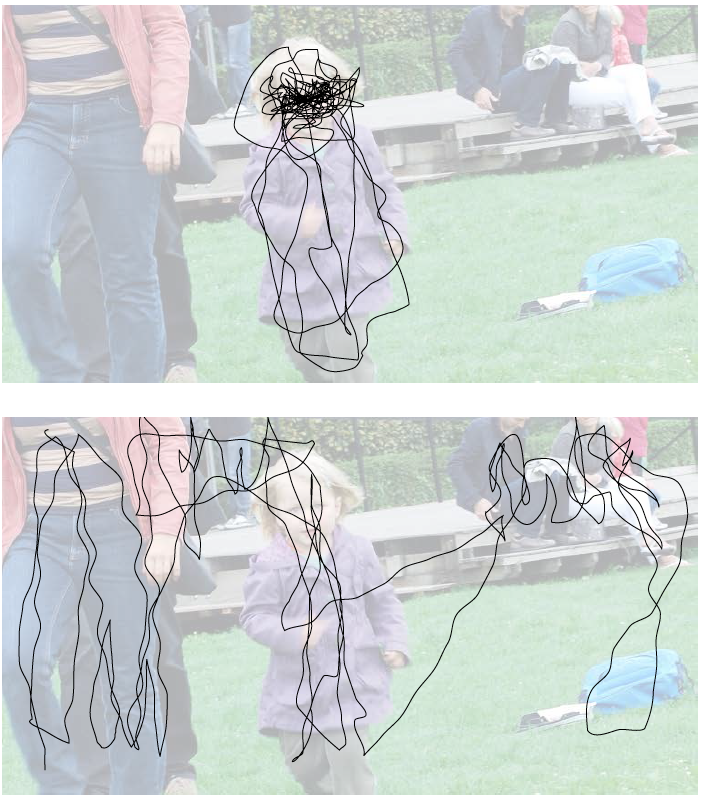

Źródło: http://www.biecek.pl/Eseje/indexObraz.html


## Jak wiedza o strategiach przeglądania obrazu może pomóc w przygotowaniu lepszej prezentacji danych? 


## Odpowiedzi

Jak wiedza o strategiach przeglądania obrazu może pomóc w przygotowaniu lepszej prezentacji danych? 

- Im więcej informacji, tym ważniejsze jest, by informacja była przedstawiana warstwowo.

- Jeżeli wykresowi towarzyszy słowna prezentacja, to warto powiedzieć, gdzie są interesujące elementy, ułatwi to ich lokalizację.

- Tytuł wykresu bardzo pomaga, ponieważ wstępnie informuje percepcję, czego wykres dotyczy i ułatwia wybór elementów wykresu do obserwacji.

- Wiele też zależy od tego, ile czasu odbiorca poświęci na analizę wykresu. Scrollowanie walla vs wystawa dzieł sztuki.


## Iluzje

Zwiększenie kontrastu pozwala szybciej zauważyć drapieżnika ukrytego w trawie, utrudnia jednak dokładne odczytywanie względnych wielkości na wykresie, szczególnie, gdy dotyczą obiektów położonych daleko od siebie.


Źródło: http://www.biecek.pl/Eseje/indexObraz.html

## Widzenie tego, czego nie ma

Im bardziej skomplikowany wykres, tym większa szansa, że coś przypadkowego zostanie uznane za ten “istotny” wzorzec.


## Widzenie tego, czego nie ma

Łatwiej jest przyjąć mózgowi, że widzi biały kwadrat ponad czterema czarnymi kółkami, niż że widzi cztery bardziej skomplikowane figury. (kwadrat i 4 x 3/4 koła). 


Źródło: http://www.biecek.pl/Eseje/indexObraz.html

##  Pseudo perspektywa

Oba pogrubione odcinki mają tę samą długość. Ukośne linie sugerują jednak perspektywę, przez którą odbieramy je jako odcinki o różnej długości.

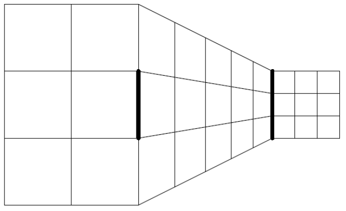

Źródło: http://www.biecek.pl/Eseje/indexObraz.html

## Pseudo perspaktywa

Jeżeli na wykresie znajdzie się cokolwiek, co może zasugerowaćperspektywę, to zostanie dostrzeżona przez mózg. Automatycznie wpłynie to na zniekształconą ocenę wielkości. 

Dlatego wszelkim trójwymiarowym wykresom, czy to kołowym, słupkowym czy piramidowym powinniśmy zdecydowanie powiedzieć: NIE.

## Problemy z kątami

Pewnych charakterystyk mózg nie jest w stanie dobrze ocenić. 
Dobrym przykładem są kąty. 

Ludzki mózg jest w stanie z dużą dokładnością ocenić, czy kąt jest bliski kątowi prostemu, ale ma duże problemy z oceną wielkości kątów ostrych i rozwartych. 

Mózg ma skłonność do zawyżania wielkości kątków ostrych i zaniżania kątów rozwartych.

## Problemy z kątami

 Iluzja Poggendorffa związana z trudnością w dokładnej ocenie kątów. Linia widoczna po lewej stronie jest przedłużeniem jednej z linii widocznych po prawej stronie. Której? 


Źródło: http://www.biecek.pl/Eseje/indexObraz.html

## Co łączy dentystę i dietetyka?


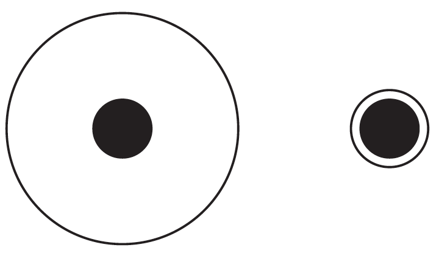

Źródła: http://www.biecek.pl/Eseje/indexObraz.html

OShea Robert, Nicholas Chandler, and Rajneesh Roy. Dentists make larger holes in teeth than they need to if the teeth present a visual illusion of size. PLoS ONE (10), 2013


## Ocena wielkości

Która z trzech poniższych beczek jest dwa razy większa niż beczka u góry?

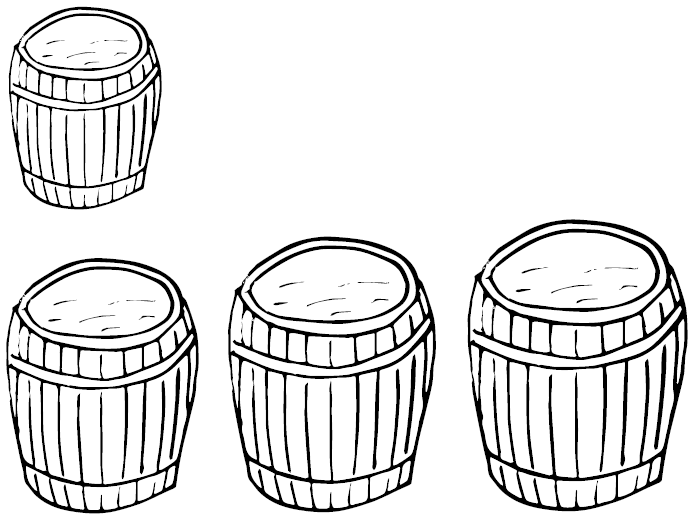

Źródło: http://www.biecek.pl/Eseje/indexObraz.html

## Ocena wielkości

Jeżeli wymiary beczki zwiększymy 1,26 razy w każdym wymiarze, to objętość będzie dwa razy większa. 


Źródło: http://www.biecek.pl/Eseje/indexObraz.html


##  Które województwo jest większe?

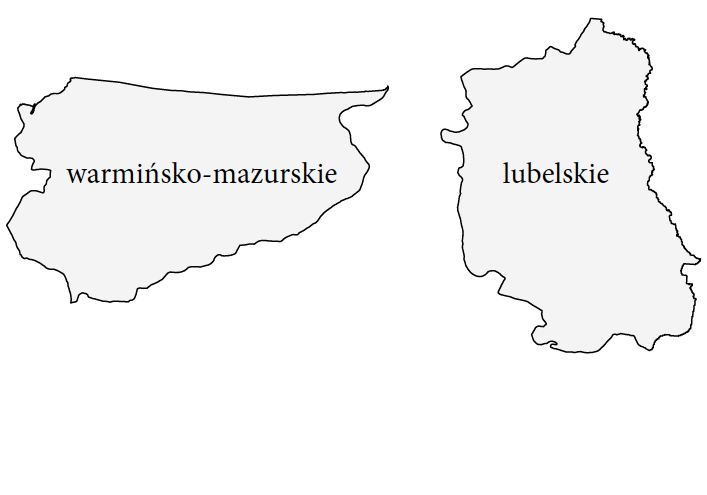

Źródło: http://www.biecek.pl/Eseje/indexObraz.html

##  Które województwo jest większe?

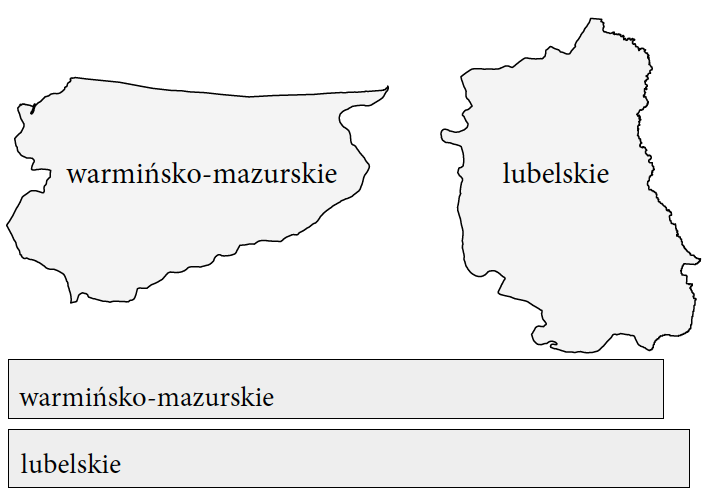

Źródło: http://www.biecek.pl/Eseje/indexObraz.html


## Hierarchia odczytywania charakterystyk

1 pozycje obiektów rozmieszczonych wzdłuż wspólnej skali (przykładowo wykres punktowy),

2 pozycje obiektów wzdłuż takiej samej, ale nie wspólnej skali (przykładowo sąsiadujące wykresy punktowe),

3 długości odcinków rozmieszczonych wzdłuż wspólnej skali,

4 długości odcinków wzdłuż takiej samej, ale nie wspólnej skali (o rożnych punktach zaczepienia),


## Hierarchia odczytywania charakterystyk


5 wielkości kątów i nachylenia (przy ocenie tempa wzrostu w wykresach liniowych),

6 powierzchnie,

7 objętości, natężenia koloru.

Na bazie The Visual Decoding of Quantitative Information on Statistical Graphs [Journal of the Royal Statistical Society Series A, 150:192--229, 1987]


## Porównanie

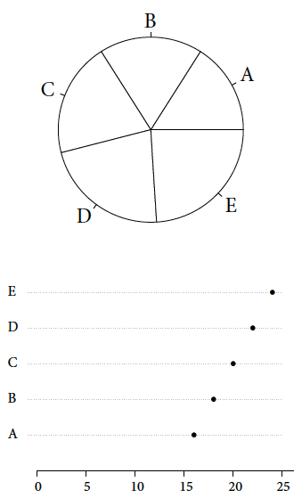

Źródło: http://www.biecek.pl/Eseje/indexObraz.html


# Percepcja kolorów

## Percepcja kolorów

W wielu wizualizacjach kolor używany jest niewłaściwie, przez co wprowadza szum, przytłacza lub wypacza informację płynącą z danych.

Jak więc dobierać kolory na wykresach?

## Kolory a przeżycie

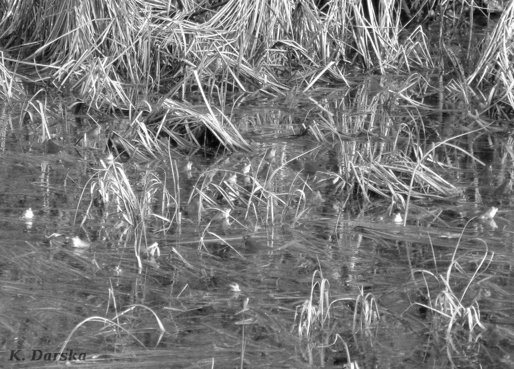

Źródło: https://jurainfo.org/zaba-moczarowa-rana-arvalis/

## Kolory a przeżycie


Źródło: https://jurainfo.org/zaba-moczarowa-rana-arvalis/


## Dlaczego dobór koloru jest ważny?

- Podświadomie przypisujemy barwom znaczenia.

- Postrzeganie barwy różni się w zależności od oświetlenia, jakości wydruku, ekranu lub projektora.


## Percepcja koloru

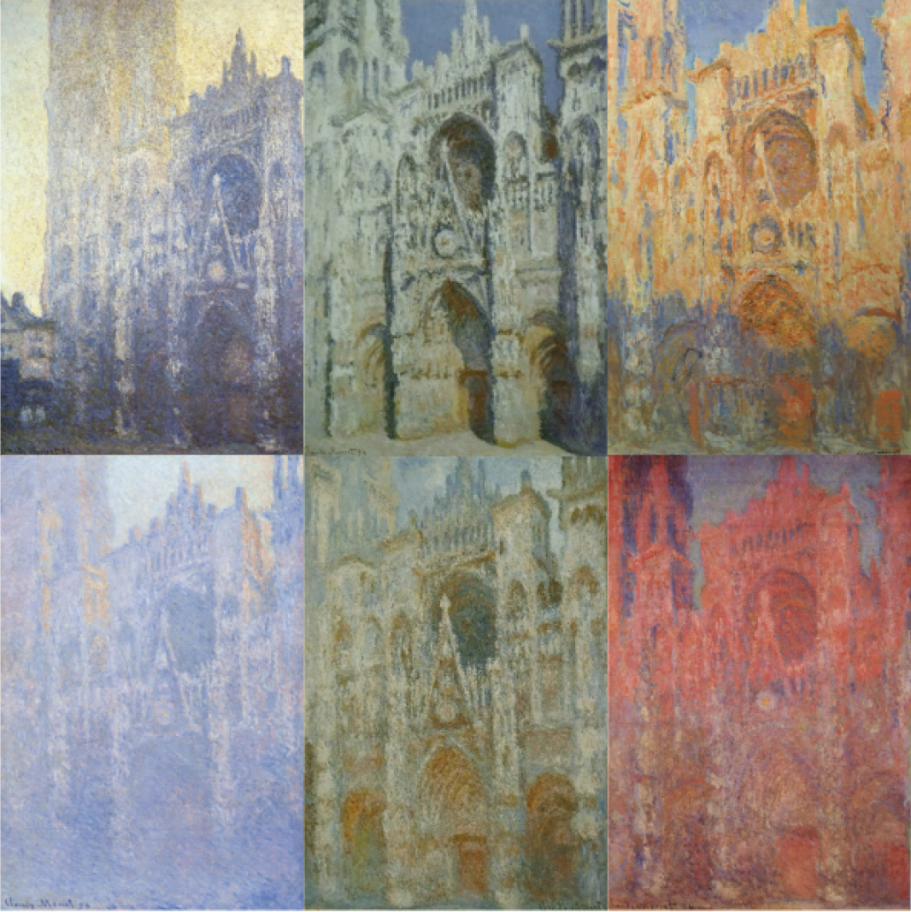

Katedra w Rouen, Claude Monet


## Wszystko jest względne


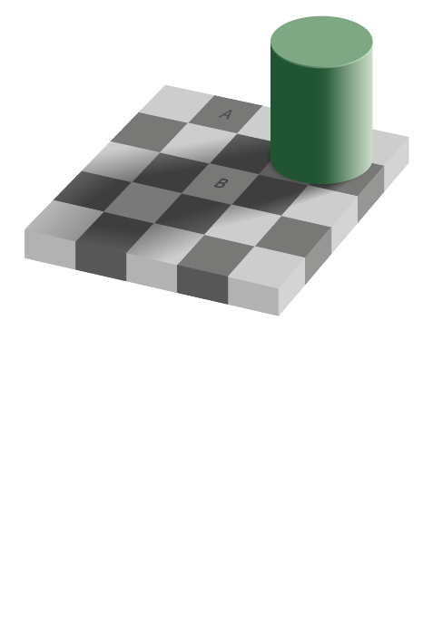

Źródło: http://www.biecek.pl/Eseje/indexKolory.html wykonane przez Adriana Pingstona


## Wszystko jest względne


Odbieramy kolory jako różne, ponieważ mózg kompensuje spodziewany efekt cienia rzucanego przez walec. 


## Wszystko jest względne


## Zaburzenia w postrzeganiu barw

Od 5 do 10 procent mężczyzn ma genetyczne problemy z postrzeganiem kolorów, w przypadku kobiet problemy te występują u mniej niż 1% populacji.

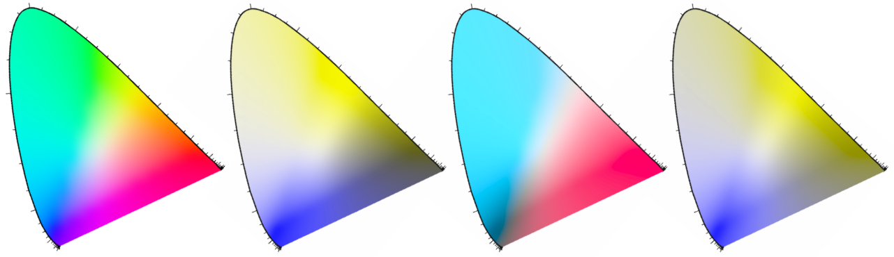

Źródło: http://www.biecek.pl/Eseje/indexKolory.html


## Zaburzenia w postrzeganiu barw

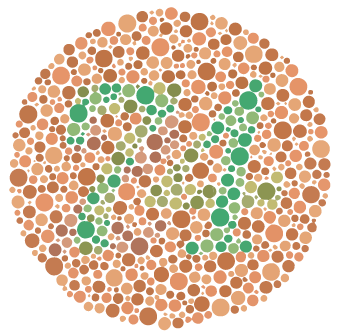

Źródło: Wikipedia, domena publiczna

## Zaburzenia w postrzeganiu barw

Jeżeli w naszej wizualizacji kolory pełnią kluczową funkcję to warto upewnić się, że przynajmniej osoby z typowymi dysfunkcjami widzenia kolorów będą w stanie odczytać informacje.

Warto wykorzystać symulator ślepoty barw. 
Na przykład Color Oracle [http://colororacle.org/](http://colororacle.org/).


## Wzorniki kolorów

Skale kolorów ColorBrewer zaproponowane przez Cynthię Brewer.

[https://colorbrewer2.org/](https://colorbrewer2.org/) <- KLIK


## Do poczytania

- Percepcja danych: http://www.biecek.pl/Eseje/indexDane.html

- Percepcja kolorów: http://www.biecek.pl/Eseje/indexKolory.html


