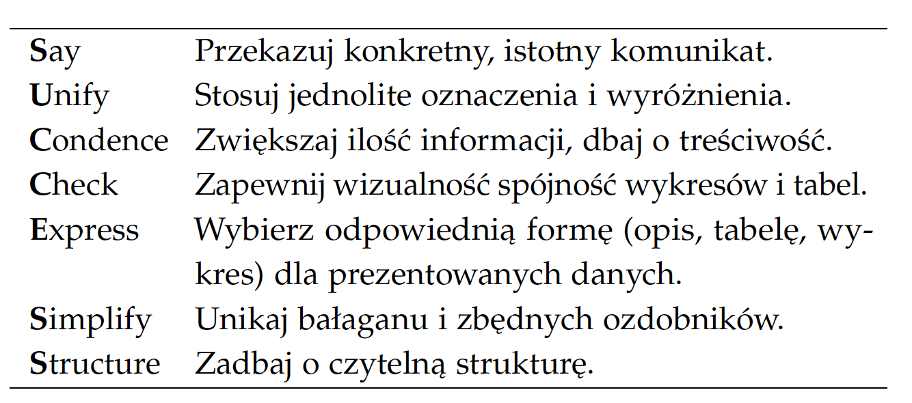
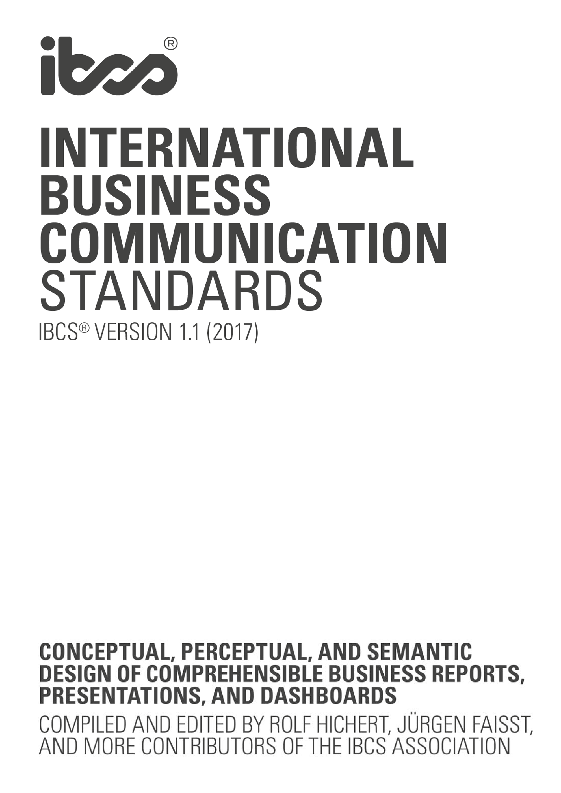

<link href="https://fonts.googleapis.com/css?family=Montserrat&display=swap" rel="stylesheet">

<style>
slides > slide {
  font-family: 'Montserrat', sans-serif;
}

.center {
  display: block;
  margin-left: auto;
  margin-right: auto;

}


</style>


```{r setup, include=FALSE}
library(knitr)
library(rgl)
library(ggplot2)
library(plotly)
library(dplyr)
library(patchwork)
library(ggthemes)
opts_chunk$set(echo = FALSE, message = FALSE, warning = FALSE)
knit_hooks$set(webgl = hook_webgl)
data("midwest", package = "ggplot2")
options(scipen=999)  # turn-off scientific notation like 1e+48
theme_set(theme_bw())  # pre-set the bw theme.
```


## https://www.ibcs.com/


## https://www.ibcs.com/standards/


## SUCCESS




Źródło: http://biecek.pl/Eseje/indexHistoria.html

## SAY

Przekaż komunikat istotny dla odbiorcy.


Źródło: https://www.ibcs.com/standards/#ids%5B%5D=17232

## SAY


Źródło: https://www.ibcs.com/standards/#ids%5B%5D=17085

## SAY


Źródło: https://www.ibcs.com/standards/#ids%5B%5D=17235


## STRUCTURE

Komunikat musi mieć czytelną strukturę.


Źródło: https://www.ibcs.com/standards/#ids%5B%5D=18110

## STRUCTURE


Źródło: https://www.ibcs.com/standards/#ids%5B%5D=18137


## EXPRESS

Wybierz odpowiednią formę (opis, tabelę, wykres).


Źródło: https://www.ibcs.com/standards/#ids%5B%5D=18385

## EXPRESS


Źródło: https://www.ibcs.com/standards/#ids%5B%5D=18392


## SIMPLIFY

Komunikat powinien być prosty.


Źródło: https://www.ibcs.com/standards/#ids%5B%5D=18441


## SIMPLIFY


Źródło: https://www.ibcs.com/standards/#ids%5B%5D=18444


## CONDENSE

Nie lej wody (w materiale pisanym).


Źródło: https://www.ibcs.com/standards/#ids%5B%5D=18524


## CHECK

Po pierwsze: nie wprowadzaj w błąd.


Źródło: https://www.ibcs.com/standards/#ids%5B%5D=18566


## CHECK


Źródło: https://www.ibcs.com/standards/#ids%5B%5D=18572


## CHECK


Źródło: https://www.ibcs.com/standards/#ids%5B%5D=18583

## UNIFY

Zadbaj o spójność.


Źródło: https://www.ibcs.com/standards/#ids%5B%5D=18819


#


