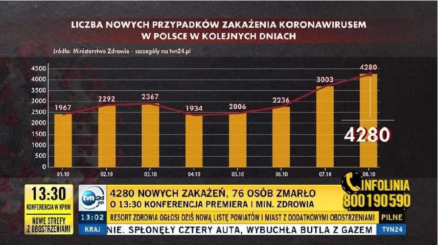
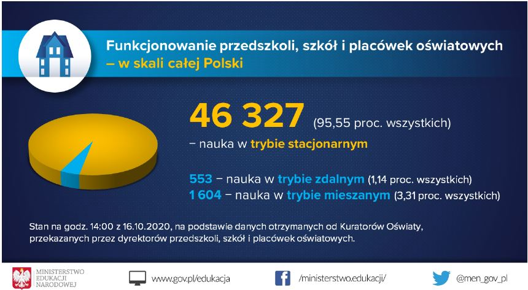
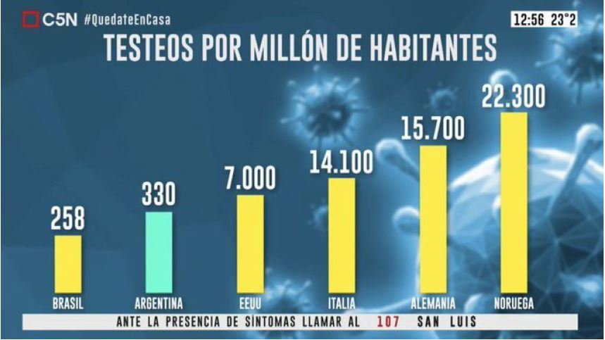
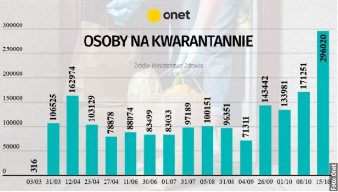
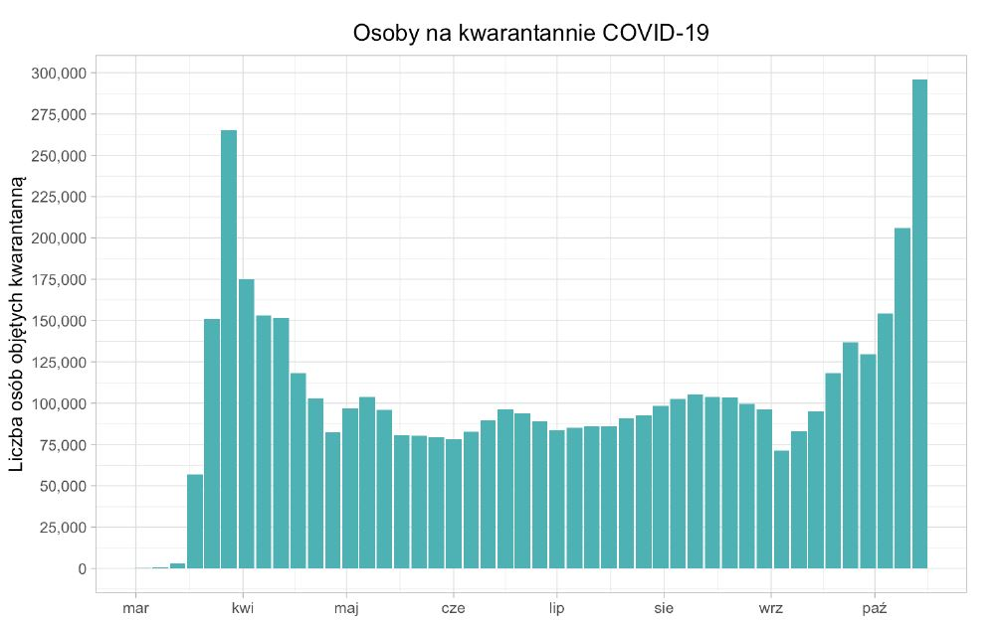
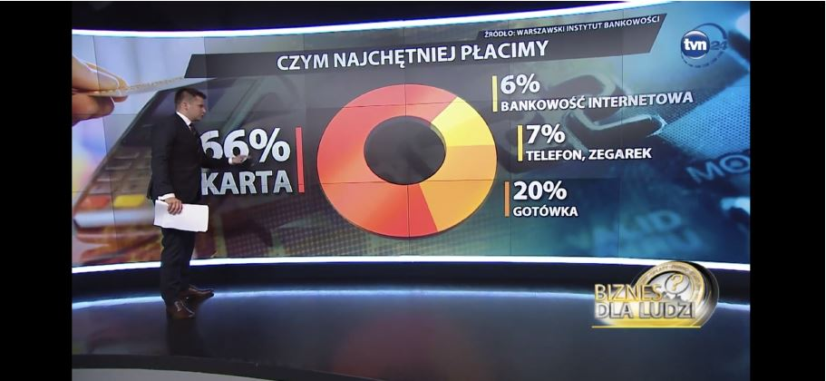
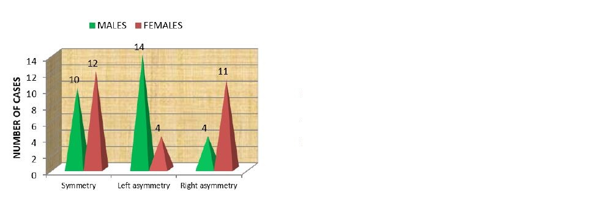
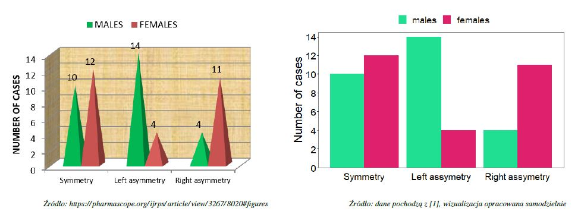

<link href="https://fonts.googleapis.com/css?family=Montserrat&display=swap" rel="stylesheet">

<style>
slides > slide {
  font-family: 'Montserrat', sans-serif;
}

.center {
  display: block;
  margin-left: auto;
  margin-right: auto;

}


</style>


```{r setup, include=FALSE}
library(knitr)
library(rgl)
library(ggplot2)
library(plotly)
library(dplyr)
library(patchwork)
library(ggthemes)
opts_chunk$set(echo = FALSE, message = FALSE, warning = FALSE)
knit_hooks$set(webgl = hook_webgl)
data("midwest", package = "ggplot2")
options(scipen=999)  # turn-off scientific notation like 1e+48
theme_set(theme_bw())  # pre-set the bw theme.
```


##


Źródło: https://www.gddkia.gov.pl/pl/aprint/36120/Przejscia-dla-zwierzat-to-kosztowny-wydatek

##


Żródło:TVN24

##


Żródło:Raport apostel.pl


## 


Źródło: https://fireandwide.com/enough_financial_budget_retirement/

Znalazca: Maciej Gryszkiewicz

##
Poprawiony wykres

```{r plot, echo=FALSE}
variable <- rep(c("bills", "car", "house", "groceries", "entertainment", "travel", "other"), each = 3)
year <- rep(c("2018/19", "2019/20", "Budget"), times = 7)
value <- c(4753, 4465, 3900, 609, 1204, 2200, 339, 1993, 1100, 7260, 7277, 10400, 6001, 4829, 10400, 13340, 6879, 20000, 5100, 4570, 0)

DF <- data.frame(year, variable, value)
DF$variable <- factor(DF$variable, levels = c("car", "house", "bills", "entertainment", "travel", "groceries", "other"))

ggplot(DF, aes(y = value, x = variable, fill = factor(year)), ) +
  geom_bar(stat = "identity", position = "dodge") +
  scale_y_continuous(labels=scales::dollar_format(prefix=intToUtf8(163)), breaks = seq(from = 0, to = 20000, by = 2500), minor_breaks = seq(from = 0, to = 21500, by = 500)) +
  scale_fill_discrete(name = "") + 
  xlab("type of expense") + ylab("") +
  ggtitle("Expenditure vs budget (by type)") 

```


##



Źródło: tvn24-Serwis informacyjny, z dnia 8.10.2020

Znalazcy: Bartosz Jamroży, Hubert Ruczyński

##
Poprawiony wykres

```{r}
date=c("1.10","2.10","3.10","4.10","5.10","6.10","7.10","8.10")
cases=c(1967,2292,2367,1934,2006,2236,3003,4280)

data <- data.frame(date = rep(date), cases = rep(cases))


ggplot(data, aes(y=cases,x=date)) +
  geom_bar(stat="identity" ,width=0.4 ,fill="darkblue")+
  geom_text(aes(label=cases),vjust=-1,size=4)+
  ylim(0,4500)+
  labs(x="",y="")
```


##


Źródło: https://www.facebook.com/ministerstwo.edukacji/photos/a.129261330508041/2935684233199056/

Znalazca: Tomasz Krupiński


##

Poprawiony wykres

```{r}
dane <- data.frame(
tryb_nauki <- c("tryb zdalny", "tryb mieszany", "tryb stacjonarny"),
ilosc_szkol <- c(553, 1604, 46327)
)
ggplot(dane, ggplot2::aes(x = tryb_nauki, y = ilosc_szkol)) +
geom_bar(stat = "identity", color = "black", fill = "lightblue") +
geom_text(ggplot2::aes(label = ilosc_szkol), vjust = -0.3, size = 3.5) +
scale_x_discrete(limits = c("tryb stacjonarny", "tryb mieszany", "tryb zdalny")) +
labs(title = "Podział szkół na tryby pracy",x = "", y = "ilosc szkół pracujacych w danym trybie") + theme_minimal()
```


##



Źródło: https://www.reddit.com/r/dataisugly/comments/g6b1vu/argentina_is_testing_like_crazy_oh_wait_let_me/

Znalazca: Kinga Ułasik

##

Poprawiony wykres

```{r}
Pais <- c( "Brasil", "Argentina", "EEUU", "Italia", "Alemania", "Noruega")
Testeos <- c(258, 330, 7000, 14100, 15700, 22300)
colores <- c("gold1", "lightblue", "gold1", "gold1", "gold1", "gold1" )
CovidPruebas <- data.frame(Pais, Testeos, colores)
CovidPruebas$Pais <-
factor(CovidPruebas$Pais, levels = c("Brasil","Argentina","EEUU","Italia","Alemania","Noruega"))
ggplot(CovidPruebas, aes(x = Pais, y = Testeos)) +
geom_bar(stat = "identity", fill = colores) +
geom_text(aes(label = Testeos), vjust=-0.3, size=3.5) +
theme_minimal()
```

## 



Źródło: https://www.onet.pl

Znalazcy: Paweł Wojciechowski, Agata Kaczmarek


##

Poprawiony wykres



## 



Źródło: Biznes dla Ludzi emitowanego w dniu 11 pazdziernika na kanale
TVN24.

Znalazca: Karol Degórski

## Poprawiony wykres

```{r}
library(ggplot2)
procent <- c(66, 20, 7, 6, 1)
Metoda_platnosci <- c("Karta", "Gotówka",
"Telefon, zegarek", "Bankowosc internetowa", "Inne")
dane <- data.frame(procent, Metoda_platnosci)
dane$Metoda_platnosci <- factor(dane$Metoda_platnosci,
levels = c("Karta", "Gotówka", "Telefon, zegarek",
"Bankowosc internetowa", "Inne"))
ggplot(dane, aes(x = Metoda_platnosci, y = procent)) +
scale_y_continuous(labels = scales::percent_format(scale = 1)) +
geom_col() + ggtitle("Czym najchetniej płacimy") +
theme(plot.title = element_text(hjust = 0.5)) +
labs(y = NULL, x = "Metoda płatnosci") +
geom_text(aes(label=paste(procent, '%')),
position=position_dodge(width=0.9), vjust=-0.25) + guides(fill=FALSE)
```


##



Żródło: https://pharmascope.org/ijrps/article/view/3267/8020#figures

Znalazca: Patryk Bojarski

##
Poprawiony wykres



Żródło: https://pharmascope.org/ijrps/article/view/3267/8020#figures


