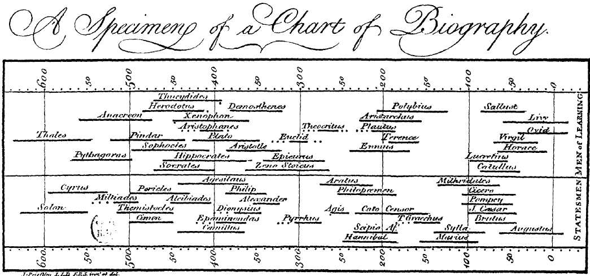
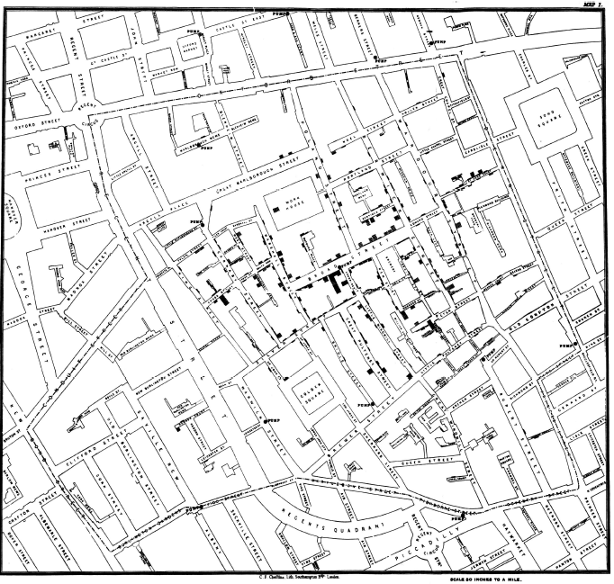
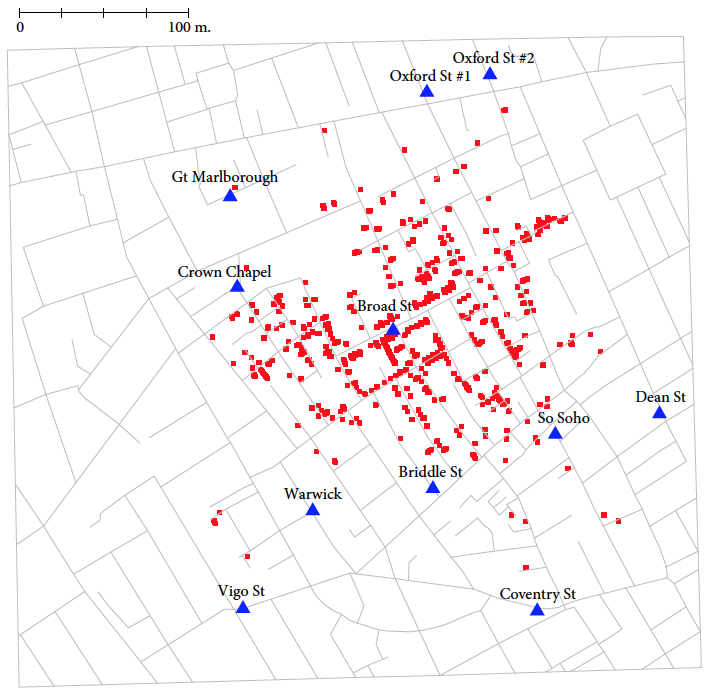
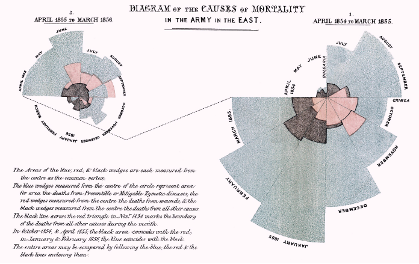
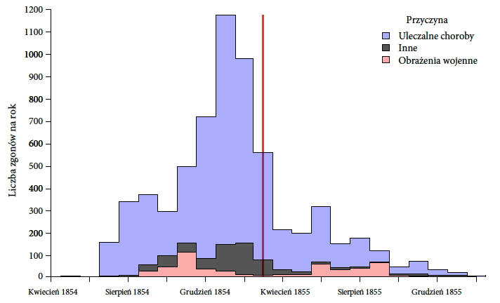
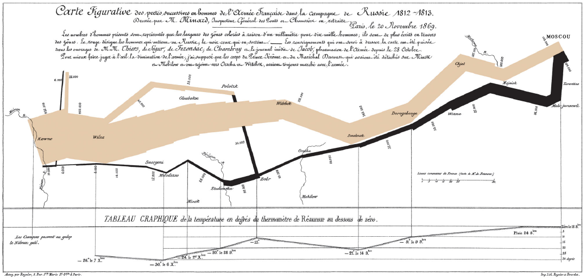
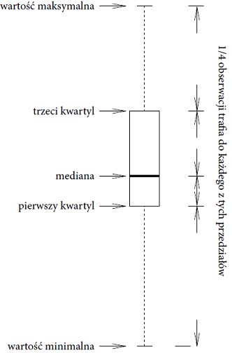
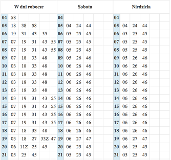

<link href="https://fonts.googleapis.com/css?family=Montserrat&display=swap" rel="stylesheet">

<style>
slides > slide {
  font-family: 'Montserrat', sans-serif;
}

.center {
  display: block;
  margin-left: auto;
  margin-right: auto;

}


</style>


```{r setup, include=FALSE}
library(knitr)
library(rgl)
library(ggplot2)
library(plotly)
library(dplyr)
library(patchwork)
library(ggthemes)
library(tidyr)

opts_chunk$set(echo = FALSE, message = FALSE, warning = FALSE)
knit_hooks$set(webgl = hook_webgl)
data("midwest", package = "ggplot2")
options(scipen=999)  # turn-off scientific notation like 1e+48
theme_set(theme_bw())  # pre-set the bw theme.
```


##  Joseph Priestley (1733–1804)

<center>
<a href="http://www.biecek.pl/Eseje/grafika/grafika/PriestleyChart.png"></a>


##  John Snow (1813–1858)

Epidemia cholery w londyńskim Soho w 1854 roku.

<center>
<a href="http://www.biecek.pl/Eseje/grafika/grafika/snowCholera.png"></a>


## John Snow (1813–1858)

<center>



## Florence Nightingale (1820–1910)

<center>
<a href="http://www.biecek.pl/Eseje/grafika/grafika/nightingaleMortality.png"></a>


## Florence Nightingale (1820–1910)

<center>



## Charles Minard (1781–1870) 

<center>
<a href="http://www.biecek.pl/Eseje/grafika/grafika/Minard.png"></a>


## John Tukey (1915–2000) - Boxplot

<center>



## John Tukey (1915–2000) - Łodyga liście

<center>



## Więcej

Przykłady poczodza z Eseju [Perełki z historii](http://biecek.pl/Eseje/indexHistoria.html).

