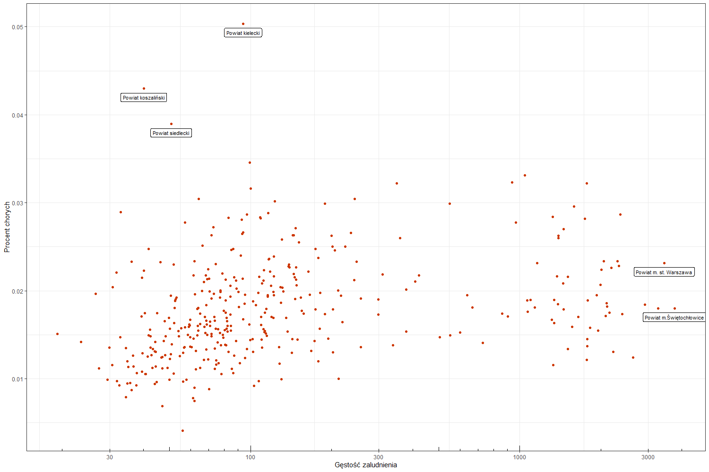
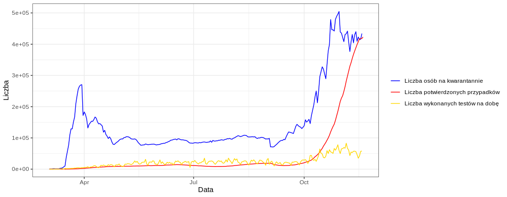

```{r setup, include=FALSE}
knitr::opts_chunk$set(echo = TRUE)
pdf.options(encoding='ISOLatin2.enc')
```

## Eksploracja danych

Przeanalizowaliśmy dane o zachorowaniach na COVID-19 w Polsce pochodzące ze zbioru Michała Rogalskiego. Dodatkowo użyliśmy danych pochodzących z GUS-u i z Wikipedii odnośnie dancyh o powiatach. Ponaddto zebraliśmy również dane o wyszukiwaniach haseł w Google w czasie trwania pandemii. Na tej podstawie stworzyliśmy następujące zależności.

## Mapa zachorowań w Polsce


Pierwsza przygotowana przez nas wizualizacja prezentuje mapę zachorowań na COVID-19 w Polsce w podziale na powiaty. Za pomocą odcieni koloru niebieskiego przedstawiony został procent zachorowań ludności w poszczególnych powiatach. Im jaśniejszy odcień niebieskiego tym większy procent osób w danym powiecie zachorował na koronawirusa.


## Procent zachorowań, a gęstość zaludnienia


Następna przygotowana przez nas wizualizacja prezentuje procent zachorowań na COVID-19 w powiatach, w zależności od gęstości zaludnienia tego powiatu. Na osi x została zastosowana skala logarytmiczna w celu zwiększenia czytelności. Możemy zauważyć jednak kilka odstajacych punktów takich jak powiat koszaliński, siedlecki czy kielecki o stosunkowo małej gęstości zaludnienia, a dużym procencie zachorowań. Natomiat powiat m. st. Warszawa i m. Świętochłowice mają dużą gęstość zaludnienia, natomiast procent zachorowań nie jest duży.


## Rozwój pandemii, a wyszukiwane hasła w Google


Powyższy wykrese prezentuje zależność między zachorowaniami w Polsce na COVID-19, a liczbą wyszukiwań haseł w wyszukiwarce Google takich jak "lockdown", czy "wirus". Na osi X mamy przedstawiony upływ czasu, a na osi Y mamy przeskalowane na skale od 0 do 100, odpowiednio liczbę zachorowań i liczbę wyszukiwań danego hasła, gdzie 100 oznacza maksymalną wartość. Z wykresu tego możemy odczytać zależność, że na początku pandemii, kiedy to przypadków zachorowań było relatywnie mało, ludzie wyszukiwali hasło "wirus" o wiele częściej niż na początku jesieni, kiedy zachorowań w Polsce było najwięcej. Co ciekawe, częstotliwość wyszukiwania hasła "lockdown" pokrywa się z ilością zachorowań. Oznacza, to że gdy w Polsce znacząco wzrastała liczba zachorowań, ludzi coraz bardziej interesowało hasło "lockdown"


## Liczba osób na kwarantannie, a liczba zachorowań i liczba wykonywanych testów na dobę


Ostatni przygotowany przez nas wykres przedstawia zależność między liczbą potwierdzonych przypadków, liczbą wykoannywanych na dobę testów, a liczbą osób na kwarantannie. Okazuje się, że na początku pandemii liczba osób na kwarantannie nie była proporcjonalna do liczby wykrytych przypadków. W późniejszym okresie (od maja do września) możemy zaoberwować, że te wszyskie trzy wielkości są do siebie proporcjonalne. Jednak ciekawa sytuacja wystąpiła na początku jesieni, kiedy to liczba potwierdzonych przypadków znacząco się zwiększyła, natomiast liczba osób na kwarantannie w pewnym momencie zaczęła się zmniejszać. Okazuje się, że dużey wzrost chorych, spowodował, że przestano izolować osoby, które mogły mieć kontakt z zarażonymi.

