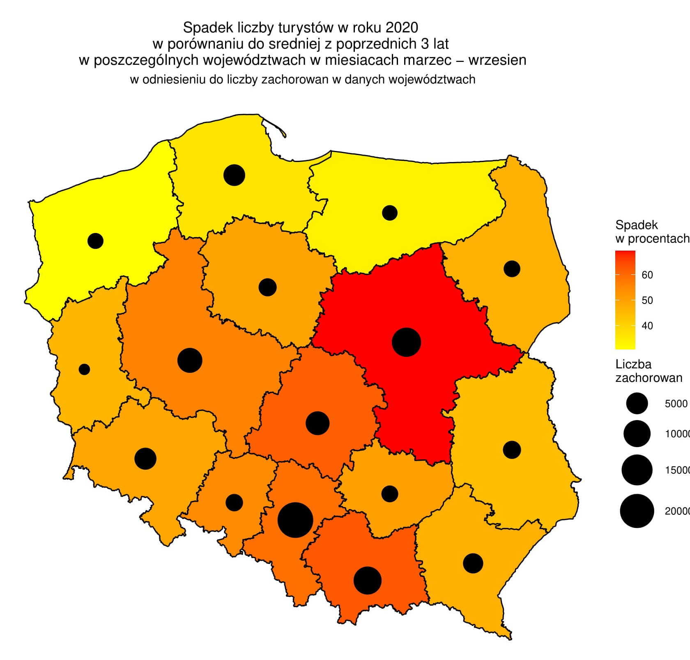

```{r setup, include=FALSE}
knitr::opts_chunk$set(echo = TRUE)
```

## Krótki opis
W ramach przygotowań do weekly 2 z projektu 2 z przedmiotu Techniki Wizualizacji Danych, przygotowałyśmy krótki raport pokazujący postępy w naszej pracy. Poniżej zaprezentujemy wykresy, każdy z krótkim opisem danych przedstawionych na nim. Wykresy wykonałyśmy z uzyciem języka R wraz z dodatkowymi pakietami.


### Wykres covidowy
Pierwszym z zaprezentowanych wykresów jest wykres przedstawiający nowe dzienne przypadki zachorowań na koronawirusa w Polsce. Jest to wykres, który pokazuje ogólny trend, ma on pomóc uzmysłowić odbiorcy wygląd trendu w zależności od wydarzeń w kraju (lockdown, wybory, rozpoczęcie roku szkolnego).


```{r, message=FALSE, warning=FALSE}
library(ggplot2)

nowe_przypadki <- read.table("Dane.csv",header=TRUE, sep=";")

nowe <-data.frame(nowe_przypadki$Data, nowe_przypadki$Nowe.przypadki)
colnames(nowe) <- c("data", "ilosc")

p<-ggplot(nowe, aes(x=as.Date(data), y=ilosc))+
  stat_smooth(se=FALSE, n=150, span=0.1 )+
  ggtitle("New cases in Poland")+
  labs(y="Number of new cases", x="Days of the epidemic")+
  theme_light()+
  theme(axis.title.x = element_text(),axis.title.y = element_text(), legend.position = "",
        plot.title = element_text(hjust = 0.5))


```


## Mapa Polski w podziale na województwa, wraz z zachorowaniami
Ta wizualizacja pokazuje podział Polski na województwa i zachorowania w każdym z nich.

```{r, message=FALSE, warning=FALSE, results = FALSE}
library(dplyr)
library(ggplot2)
library(rgdal)
library(ggmap)
library(broom)

# --- data aggregation ---

df17 <- read.csv("turysci17.csv" , sep = ';')
df18 <- read.csv("turysci18.csv" , sep = ';')
df19 <- read.csv("turysci19.csv" , sep = ';')
df20 <- read.csv("turysci20.csv" , sep = ';')
df_przypadki <- read.csv("przypadki.csv" , sep = ';')

colnames_ <- c("kod", "nazwa", "marzec", "kwiecien", "maj",
                    "czerwiec", "lipiec", "sierpien", "wrzesien", "cos")
kody <- c("02", "04", "06", "08", "10", "12",
          "14", "16", "18", "20", "22", "24", "26", "28", "30", "32")
long <- c(16.3, 18.5, 22.9, 15.2, 19.4, 20.3, 21.0,
          17.9, 22.2, 22.9, 17.9, 19.0, 20.7, 20.7,
          17.1, 15.4)
lat <- c(51.1, 53.0, 51.2, 52.1, 51.5, 49.7, 52.4,
         50.6, 49.9, 53.2, 54.2, 50.4, 50.7, 53.8,
         52.2, 53.5)

colnames(df17) <- colnames_
colnames(df18) <- colnames_
colnames(df19) <- colnames_
colnames(df20) <- colnames_

df17 <- mutate(df17, suma = marzec + kwiecien + maj + czerwiec + lipiec + sierpien + wrzesien )
df17 <- select(df17, c("nazwa", "suma"))
df18 <- mutate(df18, suma = marzec + kwiecien + maj + czerwiec + lipiec + sierpien + wrzesien )
df18 <- select(df18, c("nazwa", "suma"))
df19 <- mutate(df19, suma = marzec + kwiecien + maj + czerwiec + lipiec + sierpien + wrzesien )
df19 <- select(df19, c("nazwa", "suma"))
df20 <- mutate(df20, suma = marzec + kwiecien + maj + czerwiec + lipiec + sierpien + wrzesien )
df20 <- select(df20, c("nazwa", "suma"))

df_sr <- data.frame("nazwa" = df19$nazwa, 
                    srednia = (df19$suma +  df18$suma + df17$suma)/3)

df_przypadki <- cbind(df_przypadki, long, lat)
data_for_map <- data.frame(nazwa = df20$nazwa,
                           spadek_procentowy =
                             (df_sr$srednia -
                      df20$suma)/df_sr$srednia*100,
                      kod = kody)

wojewodztwa <- readOGR("Województwa.shp", "Województwa")
wojewodztwa <- spTransform(wojewodztwa, CRS("+init=epsg:4326"))

wojewodztwa_df <- tidy(wojewodztwa, region="JPT_KOD_JE")

mapki <- left_join(wojewodztwa_df,
                   data_for_map %>%
                     select(kod, nazwa, spadek_procentowy),
                   by=c("id"="kod"))

p <- ggplot(mapki) +
  geom_polygon(aes(long, lat, group=group,  fill=spadek_procentowy), color="black") +
  scale_fill_gradient(low = "yellow", high = "red") +
  coord_map() +
  geom_point(data = df_przypadki, aes(long, lat, size = SUMA)) +
  scale_size(range = c(4,14)) +
  theme_void() +
  labs(fill="Spadek \nw procentach", size = "Liczba \nzachorowań") +
  ggtitle(label = "Spadek liczby turystów w roku
          2020 \nw porównaniu do średniej z
          poprzednich 3 lat \nw poszczególnych
          województwach w miesiącach marzec
          wrzesień", subtitle = "w odniesieniu do
          liczby zachorowań w danych województwach") +
  theme(plot.title = element_text(hjust = 0.5),
    plot.subtitle = element_text(hjust = 0.5))
```


\newpage
## Zmiany w przemieszczaniu się Polaków w kolejnych miesiącach 
Kolejny wykres pokazuje nam zmiany w mobilności Polaków w kolejnych miesiącach. Dodatkowo mamy na nim również przedstawiony wskaźnik zachorowań na tysiąc mieszkańców.

```{r, message=FALSE, warning=FALSE}
library(dplyr)
library(data.table)
library(ggplot2)

a <- fread("2020_PL_Region_Mobility_Report.csv")
a <- a %>%
  select(date,retail_and_recreation_percent_change_from_baseline,
         grocery_and_pharmacy_percent_change_from_baseline,
         parks_percent_change_from_baseline,
         transit_stations_percent_change_from_baseline,
         workplaces_percent_change_from_baseline,
         residential_percent_change_from_baseline)
a$date = as.Date(a$date)

nowe_przypadki <- read.table("Dane.csv",header=TRUE, sep=";")
nowe <-data.frame(nowe_przypadki$Data, nowe_przypadki$Nowe.przypadki)
colnames(nowe) <- c("date", "ilosc")

minimum<-as.Date("2020-03-04")
maximum<-as.Date("2020-11-17")
nowe$date<- as.Date(nowe$date)

b <- a %>%
  filter(date>=minimum)
c<-nowe%>%
  filter(date<=maximum)

wynikowe<-inner_join(b,c,by = "date")
wynikowe$ilosc<- wynikowe$ilosc/1000

pp2<-ggplot(rbind(data.frame(x=wynikowe$date,
                            y=wynikowe$retail_and_recreation_percent_change_from_baseline,
                             type="retail_and_recreation"),
                  data.frame(x=wynikowe$date,
                             y=wynikowe$grocery_and_pharmacy_percent_change_from_baseline,
                             type="grocery_and_pharmacy"),
                  data.frame(x=wynikowe$date,
                             y=wynikowe$workplaces_percent_change_from_baseline,
                             type='workplaces'),
                  data.frame(x=wynikowe$date,
                             y=wynikowe$residential_percent_change_from_baseline,
                             type='residential'),
                  data.frame(x=wynikowe$date,y=wynikowe$ilosc,
                             type = 'disease rate per 1,000 inhabitants')),
            aes(x=x,y=y,color=type))+
  geom_smooth()+
  scale_color_manual(values = c("retail_and_recreation" = '#E69F00',
                                "grocery_and_pharmacy" = '#56B4E9',
                                "workplaces" = '#009E73',
                                "residential" = '#D55E00',
                                "disease rate per 1,000 inhabitants" = "#000000"))+
  scale_y_continuous(name = "Mobility(%)",
                     sec.axis = sec_axis(~.+0,
                                         name = "Disease rate per 1,000 inhabitants"))+
  theme_light()+
  ggtitle("Comparison of the trend of Covid to mobility in Poland")+
  xlab("Date")
pp2


```

## Różnica w liczbie turystów odwiedzających Polskę
Ten wykres pokazuje jak zmieniła się liczba turystów z dwudziestu innych krajów odwiedzających Polskę w części roku 2020 i analogicznym okresie w 2019 roku.
```{r message=FALSE, warning=FALSE}
library(dplyr)
library(ggplot2)
library(rgdal)
library(ggmap)
library(broom)

data <- read.csv("Noclegi_udzielone_turystom.csv" , sep = ';')

data %>% 
  filter(Rok == 2019 & Miesiac %in% 
           c("3", "4", "5", "6"), Rodzaj.obiektu.noclegowego == "ogółem") %>% 
  select(Kraj.turysty, Wartosc, Miesiac) %>% 
  mutate(Wartosc = as.numeric(as.character(Wartosc))) -> data19

data19 = aggregate(data19$Wartosc, by=list(Kraje=data19$Kraj.turysty), FUN=sum)

data %>% 
  filter(Rok == 2020 & Miesiac %in% 
           c("3", "4", "5", "6"), Rodzaj.obiektu.noclegowego == "ogółem") %>% 
  select(Kraj.turysty, Wartosc, Miesiac) %>% 
  mutate(Wartosc = as.numeric(as.character(Wartosc))) -> data20

data20 = aggregate(data20$Wartosc, by=list(Kraje=data20$Kraj.turysty), FUN=sum)

data_for_chart <- data.frame(kraj = data19$Kraje, t2019 = data19$x, t2020 = data20$x)
data_for_chart <- filter(data_for_chart, 
                         kraj != "Zagranica" & kraj != "Polska" & kraj != "Ogółem" 
                         & kraj != "Niemcy" & t2019 >= 50000)

data_for_chart <- mutate(data_for_chart, spadek_procentowy = (t2019 - t2020)/t2019*100)

ggplot(data_for_chart, aes(y=kraj)) + 
  geom_point(aes(x = data_for_chart$t2020/1000, color = "2020"), size = 3,
             shape = I(15)) +
  geom_point(aes(x=data_for_chart$t2019/1000, color = "2019"), size = 3, shape = I(15)) +
  geom_segment(aes(x = data_for_chart$t2019/1000,
                   y = kraj,
                   xend = data_for_chart$t2020/1000,
                   yend = kraj),
               size = 1) +
  ylab("Kraj turysty") + xlab("Liczba turystów [tyś]") +
  ggtitle("Różnica w liczbie turystów odwiedzających Polskę 
          \nw miesiącach marzec - czerwiec w latach 2019 i 2020")+
  labs(color = "Rok") +
  theme_bw() +
  theme(plot.title = element_text(hjust = 0.5))
```

## Spadek procentowy liczby turystów odwiedzających Polskę
Kolejna wizualizacja pokazuje spadek procentowy liczby turystów, którzy odwiedzali Polskę między marcem a czerwcem w 2020 roku i analogicznym okresem w roku poprzednim.

```{r, message=FALSE, warning=FALSE}
library(dplyr)
library(ggplot2)
library(rgdal)
library(ggmap)
library(broom)

data <- read.csv("Noclegi_udzielone_turystom.csv" , sep = ';')

data %>% 
  filter(Rok == 2019 & Miesiac %in% 
           c("3", "4", "5", "6"), Rodzaj.obiektu.noclegowego == "ogółem") %>% 
  select(Kraj.turysty, Wartosc, Miesiac) %>% 
  mutate(Wartosc = as.numeric(as.character(Wartosc))) -> data19

data19 = aggregate(data19$Wartosc, by=list(Kraje=data19$Kraj.turysty), FUN=sum)

data %>% 
  filter(Rok == 2020 & Miesiac %in% 
                  c("3", "4", "5", "6"), Rodzaj.obiektu.noclegowego == "ogółem") %>% 
  select(Kraj.turysty, Wartosc, Miesiac) %>% 
  mutate(Wartosc = as.numeric(as.character(Wartosc))) -> data20

data20 = aggregate(data20$Wartosc, by=list(Kraje=data20$Kraj.turysty), FUN=sum)

data_for_chart <- data.frame(kraj = data19$Kraje, t2019 = data19$x, t2020 = data20$x)
data_for_chart <- filter(data_for_chart, 
                         kraj != "Zagranica" & kraj != "Polska" & kraj != "Ogółem" 
                         & kraj != "Niemcy" & t2019 >= 50000)

data_for_chart <- mutate(data_for_chart, spadek_procentowy = (t2019 - t2020)/t2019*100)

ggplot(data_for_chart, aes(x = spadek_procentowy, y = kraj)) +
  geom_bar(stat = "identity", fill = "brown", color = "black", width=0.7) +
  ylab("Kraj turysty") + xlab("Spadek procentowy") +
  ggtitle("Spadek procentowy liczby turystów odwiedzających Polskę 
          \nw miesiącach marzec - czerwiec w 2020 roku 
          \nw porównaniu do roku 2019") +
  theme_bw() +
  theme(plot.title = element_text(hjust = 0.5))

```

## Ilość przypadków a Google Trends
Tutaj pokazałyśmy ilość zdiagnozowanych nowych przypadków koronawirusa i ilość wyszukań w Google frazu 'koronawirus'.

```{r, message=FALSE, warning=FALSE}
library(dplyr)
library(data.table)
library(ggplot2)

dane <- read.table("multiTimeline.csv",header=TRUE, sep=",")
nowe_przypadki <- read.table("Dane.csv",header=TRUE, sep=";")
nowe <-data.frame(nowe_przypadki$Data, nowe_przypadki$Nowe.przypadki)
colnames(nowe) <- c("date", "ilosc")


nowe$tydzien <- format(as.Date(nowe$date),"%W")
dane$tydzien <- format(as.Date(dane$Tydzien),"%W")
new<- data.frame(nowe$tydzien,nowe$ilosc)
new<- new%>%
  group_by(nowe.tydzien)%>%
  summarise(suma = sum(nowe.ilosc))
colnames(new)<- c("tydzien","suma")


wynikowe<- inner_join(dane,new,by='tydzien')
wynikowe$Tydzien<- as.Date(wynikowe$Tydzien)

wykres<-ggplot(rbind(data.frame(x = wynikowe$Tydzien,
                                y = (wynikowe$koronawirus...Polska.)*1800,
                                type = "wyszukania"),
                     data.frame(x = wynikowe$Tydzien,
                                y = wynikowe$suma.y,
                                type = "nowe przypadki zachorowania")),
               aes(x=x,y=y,color=type))+
  geom_smooth()+
  geom_point()+
  scale_y_continuous(
    name="Suma przypadków w tygodniu",
    sec.axis = sec_axis(~./1800,name="trend wyszukań frazy koronawirus w tygodniu")
  )+
  scale_color_manual(values = c("wyszukania" = '#00A4E6',
                                "nowe przypadki zachorowania" = '#fa9fb5'
                                ))+
  xlab("Tydzień")+
  ggtitle("Porównanie ilości przypadków zachorowań 
          do ilości wyszukań frazy koronawirus 
          w Google")+
  theme_light()+
  theme(
    axis.line.y = element_line(color = "#fa9fb5"),
    axis.line.y.right = element_line(color = "#00A4E6")
  )
  
  
wykres
```


