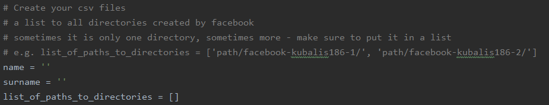
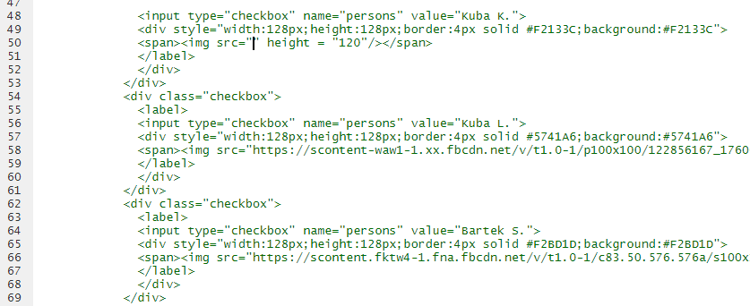

# My Facebook Data

Aplikacja jest dostępna pod linkiem: https://kuba639.shinyapps.io/message_analysis/

## Co jeśli chcesz przeanalizować swoje dane?

Sposób na przeanalizowanie swoich danych, prosty, lecz drastyczny.

Pobieramy swoje dane z facebooka (wystarczą dotyczące wiadomości).

Pliki te przetwarzamy w Pythonie.
Podajemy swoje imię i nazwiko w pliku main.py

Program wygeneruje potrzebne pliki csv.
Drastyczność sposobu polega na zaakceptowaniu faktu, że będziemy się nazywać Jakub Koziel, Kuba Lis lub Bartek Sawicki.
Zmieniamy nazwę jednego z wygenerowanych plików: messages_Imie_Nazwisko.csv na taką samą nazwę tylko zawiejącą imię i nazwisko jednej osoby z zespołu (pozostałych plików generowanych w Pythonie pomimo, że powstały - nie używamy w naszej aplikacji). Plik z prawdziwymi danymi tej osoby usuwamy z folderu.

Opcjonalnie (warto ze względu na łatwość w wykonaniu) można zmienić jeszcze wyświetlane zdjęcie z Facebook'a wybranej osoby (tej, którą nazwaliśmy swój plik csv) na swoje. Udajemy się na nasz profil i klikamy na zdjęcie profilowe prawym przyciskiem wybierając kopiuj adres obrazu.

W zaznaczonym miejscu wklejamy link do zdjęcia. Pamiętajmy, że miejsce wklejenia linku jest odpowiednio inne, jeśli przyjęliśmy imię inne niż Jakub Koziel.

Należy też zauważyć, że w pliku all_emoji.csv (w folderze data_preparation/data) przechowujemy tylko takie emoji, które nasz zespół w sumie użył minimum 10 razy (dlatego zawiera wszystkie popularne i w większości przypadków na pewno wystarczające). Gdyby nam zależało na zaktualizowaniu tego pliku należy wczęsniej uruchomić skrypt create_emoji_csv.R, ale jego wykonanie zajmuje trochę czasu.

Gotowe, możesz zacząć używać aplikacji na swoich danych. Miłej zabawy!
