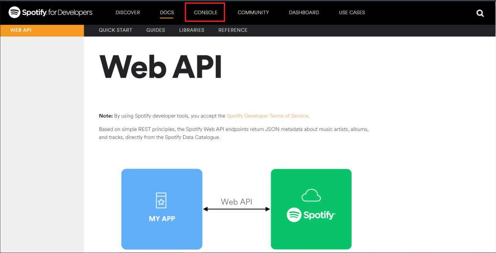
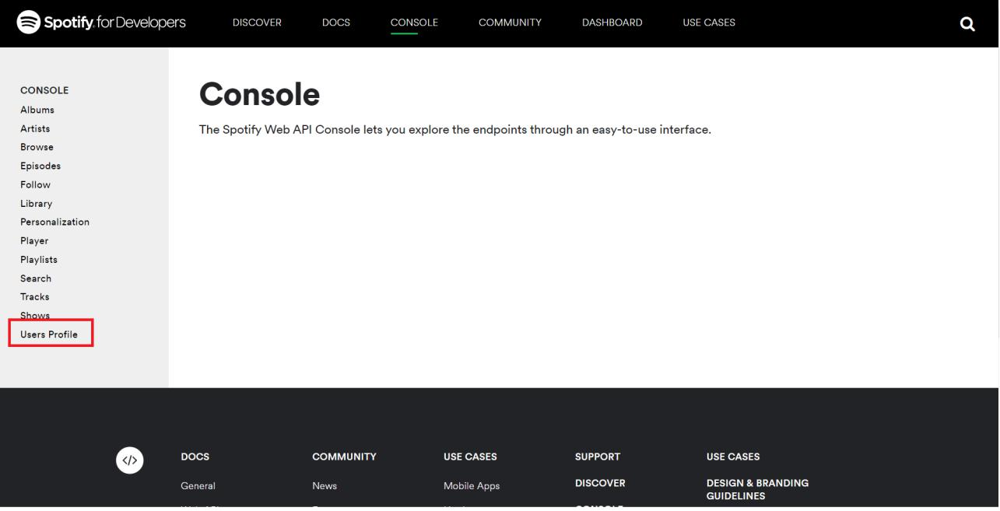
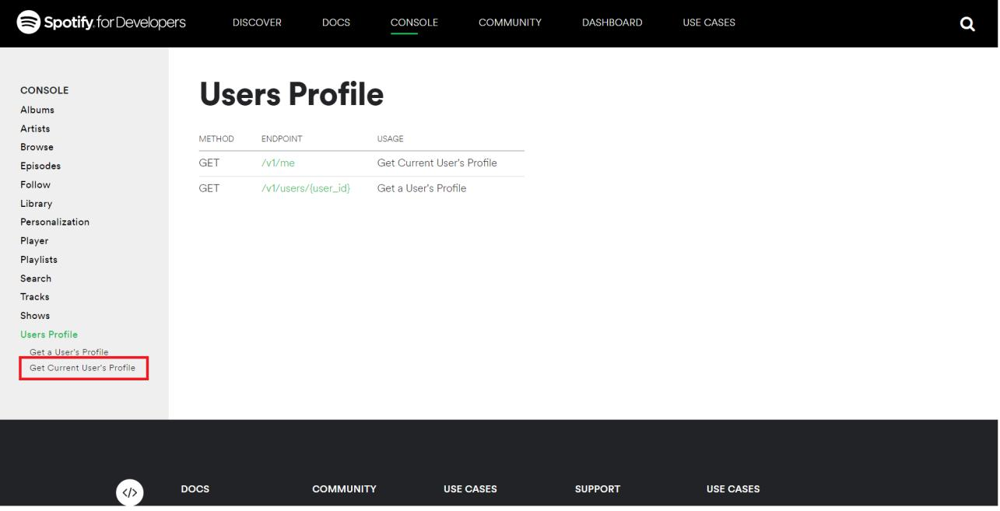
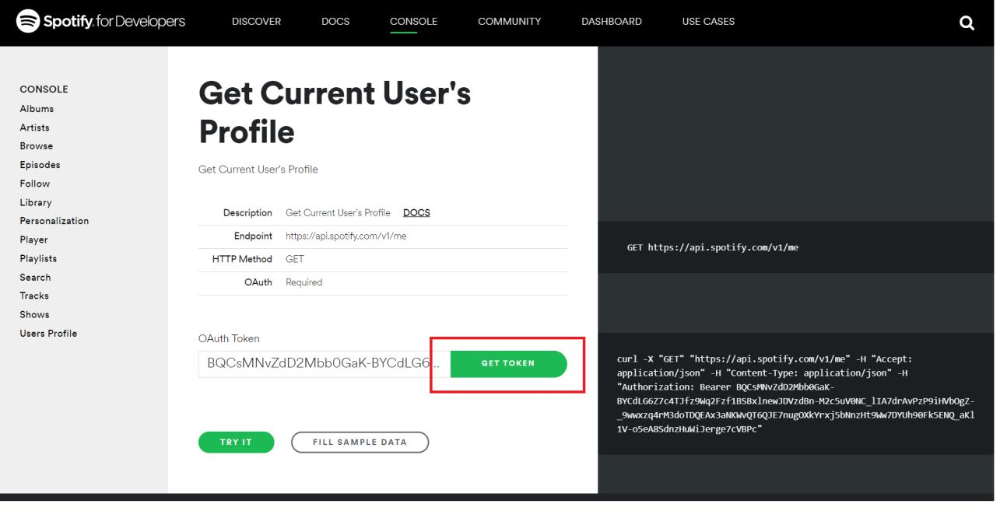
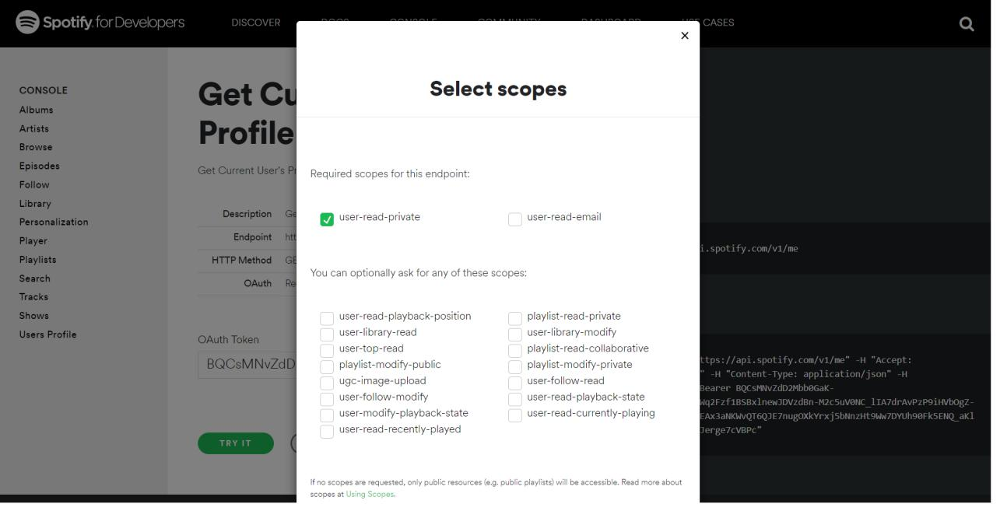

Link do aplikacji: https://denkakai.shinyapps.io/apptwd3/

Link do filmu z opisem: https://youtu.be/rTxQWiHw_AU

Jak uzyskać token do danych z serwisu Spotify ?

1. Wejdź na stronę https://developer.spotify.com/documentation/web-api/.

2. Kliknij zakładkę “Console”.
    

3. Wybierz interesującą Cię kategorię z menu po lewej (ja chcę uzyskać informacje o swoim profilu, a więc klikam zakładkę “Users Profile”.

4. Następnie wybierz interesujący Cię zakres danych.

5. Kliknij “GET TOKEN”

6. Wyraź wybrane zgody.

7. Jeśli nie jesteś zalogowany do serwisu, zrób to teraz.

8. Wyświetli Ci się Twój token. Po kliknięciu “TRY IT”, po prawej stronie zobaczysz plik JSON z wybranymi przez siebie danymi.
